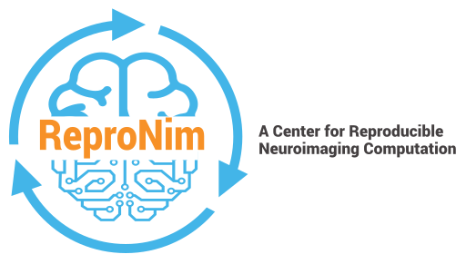

.. HowWouldReproNim documentation master file, created by
   sphinx-quickstart on Thu Jun 11 16:48:23 2020.
   You can adapt this file completely to your liking, but it should at least
   contain the root `toctree` directive.

	

=====================================================
Welcome to the "How Would ReproNim Do *That*?" Series
=====================================================

**Overview**

ReproNim has created a lot of tools. It is often confusing, however, how these tools fit together to solve specific problems. In the “How would ReproNim do that?” series of documents, we look at a number of real world problems and discuss the “ReproNim Way” of handling them. We try to compare and contrast the ReproNim Way relative to the “traditional” way of handling these topics, and explore the potential costs and benefits that come with the ReproNim approach.

.. important::

   The handbook is currently in pre-alpha stage.
   If you would be willing to provide feedback on its contents, please
..   `get in touch <https://github.com/datalad-handbook/book/issues/new>`_.
 
Volume 1: How Would ReproNim Do Local Container Analysis
========================================================

**Problem Statement**: I have an image file (anat.nii); I have a container I want to run (neuronets/kwyk:latest-cpu); and I’d like to ‘manage’ the process and output in a reproducible way and then publish this process so that someone else could do the same thing.

**Stakeholder**: End User (Data Analyst)

`Published doc <https://docs.google.com/document/d/1Mq8Tsn8o8EKz2O4dyJJaHdNtZTzptb9eoGcZk7ZfsnE/edit#heading=h.f2r73p8wqece>`_

 .. toctree::
     :maxdepth: 2
     :caption: Run a container:
 
     vol01/intro

Volume 2: How Would ReproNim publish a dataset
==============================================
 
**Problem statement**: I’ve got a study; N subjects, Nifti data, behavioral metadata (subject demographics) in csv file. I’d like to publish this in a FAIR (particularly reusable, i.e. self describing) way.

**Stakeholder**: End User (Data Acquirer)

`Published doc <https://docs.google.com/document/d/1wv-COdc2wYHepTENGZ8PbcWuxWLMjxMmvKPxOdJhkRY/edit#heading=h.f2r73p8wqece>`_

Volume 3: How Would ReproNim NIDMify my software
================================================

**Problem Statement**: I’m a tool developer, I have a new volumetric tool.  How do I make it ReproNim compliant (i.e. NIDMify it) (provenance and output?

**Stakeholder**: Software Developer

Published doc: TBD

Volume 4: How Would ReproNim Managing Local FreeSurfer Results
==============================================================

**Problem statement**: I’m an investigator, I’ve already run a bunch of FreeSurfers (and other volume tools). How do I integrate my local results with public results (the ReproLake)?

**Stakeholder**: End User (Data Analyst)

`Published doc <https://docs.google.com/document/d/18Ud5RWec-As65-FFgkzcwf9agVtxW9bcozZeuLyfRNM/edit#heading=h.f2r73p8wqece>`_

Volume 5: How Would ReproNim Markup Local Behavioral Data in RedCap for Export
==============================================================================

**Problem Statement**: I have a new study with the behavioral data in RedCap. How do I maintain (and export this) in the ReproNim way?

**Stakeholders**: Data Managers

Published doc: TBD

Volume 6: How Would ReproNim do ABCD analysis
=============================================

**Problem Statement**:  I have access to ABCD data, and would like to run a containerized analysis on that imaging data. More specifically, let’s say that the container I’d like to run is dcanlabs/abcd-hcp-pipeline:latest (GitHub, DockerHub), a “bids application for processing functional MRI data, robust to scanner, acquisition and age variability”.

**Stakeholders**: End User (Data Analyst)

`Published doc <https://docs.google.com/document/d/1KR_dU3FMu2Fa67SZqMu_FnUWJID5qnRwyfGfni7k9Uw/edit#heading=h.6xrv3m2migir>`_

Volume 7: How Would ReproNim Read DICOM data?
=============================================

**Problem Statement**: I’ve got DICOM data from my scanner. How to I ‘ingest’ this data in a  version and provenance aware fashion? 

**Stakeholders**: End User (Data Acquirer) / Data Managers

Published doc: TBD

Volume 8: How Would ReproNim Make Reproducibility Manageable
============================================================

(aka 5-Steps to More Reproducible Neuroimaging Computation)
**Problem Statement**: There are so many things one has to do to make everything completely reproducible. Is there a list of smaller, more manageable steps I can engage that will still make a positive difference?

**Stakeholders**: Everyone

Published doc: TDB

Volume 9: Containerize a Workflow (Enigma Container for Shape Analysis)
=======================================================================

**Problem Statement**: I have an analysis workflow I run locally. I would like to make it into a containerized workflow. We explore this topic using the ENIGMA Sulcal Shape analysis workflow as an example. 

**Stakeholders**: Data Analyst

`Published doc <https://docs.google.com/document/d/1J93-tOpKtXQvOZ_fD0-8JV4W5iSBrXbIF6UVEpm37_8/edit#heading=h.f2r73p8wqece>`_
