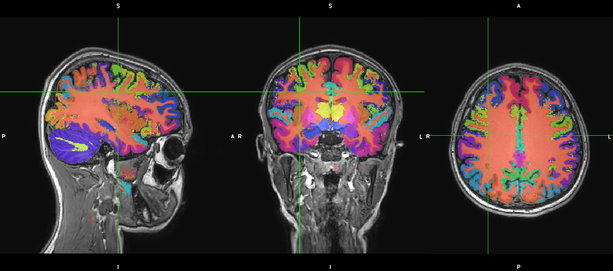
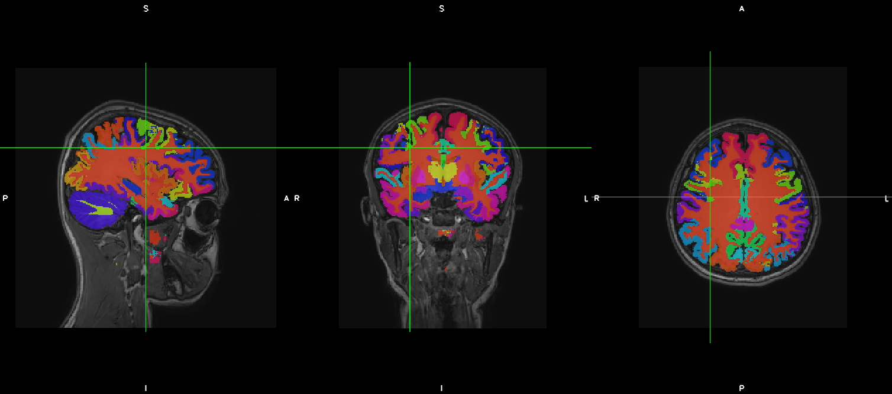

Volume 1: How Would ReproNim Do Local Container Analysis
--------------------------------------------------------

**Problem Statement**: I have an image file (anat.nii); I have a container I want to run (neuronets/kwyk:latest-cpu); and I’d like to ‘manage’ the process and output in a reproducible way and then publish this process so that someone else could do the same thing.

**Stakeholder**: End User (Data Analyst)

`Published doc <https://docs.google.com/document/d/1Mq8Tsn8o8EKz2O4dyJJaHdNtZTzptb9eoGcZk7ZfsnE/edit#heading=h.f2r73p8wqece>`_

**Overview**

- :ref:`vol1_problem_statement`
- :ref:`vol1_repronim_solution`
- :ref:`vol1_costs`
- :ref:`vol1_gains`
- :ref:`vol1_conclusion`

.. heresthegist::

   The document contains a lot of words ...

   [add the short overview in here, i was lazy because I couldn't copy-paste it from the google doc... :) ]

.. findoutmore:: click here

   here's more content, useful to hide extra infos

.. _vol1_problem_statement:

Problem Statement
^^^^^^^^^^^^^^^^^

Here’s a simple ‘real world’ problem. I have an image file (``anat.nii``);
I have a container I want to run (neuronets/kwyk:latest-cpu);
and I’d like to ‘manage’ the process and output in a reproducible way and then publish this process so that someone else could do the same thing.

.. _vol1_repronim_solution:

ReproNim Solution
^^^^^^^^^^^^^^^^^

In theory
"""""""""

At a high level, ReproNim would suggest that your image file should be under content management;
that your container should be under content management, and you should run your processing in a way that manages the output.
More specifically, this means that we should put the image file under `DataLad <https://www.datalad.org/>`_ control, put the container under DataLad control, and run the container on the data using :command:`dataLad run <container>`’.

In Practive, the gory details...
""""""""""""""""""""""""""""""""

OK, let’s do this!
I’m working in a directory called: ``/Users/davidkennedy/ReproKwyk``
The contents is simply my structural scan: ``anat.nii``

**Step 1**: “your image file should be under content management” (i.e. put the image file under DataLad control)
`Yarik <http://haxbylab.dartmouth.edu/ppl/yarik.html>`_ says:
To put my ``anat.nii`` under DataLad control, do the following:

.. code-block:: bash

   $ datalad add -m "Added my favorite anatomy file" anat.nii

This assumes you have DataLad. I do

.. code-block:: bash

   $ datalad --version
     datalad 0.11.7

Is that up to date? Check `here <https://github.com/datalad/datalad/releases>`__.
Need to install DataLad?  See `here <https://www.datalad.org/get_datalad.html>`__.
Also, make sure to install `DataLad-Container <https://github.com/datalad/datalad-container>`_.

So, conceptually we ‘just’ need to add the image file to DataLad control. But in datalad, the image file has to be part of some project. In our example, we don’t yet have a project, so we’ll need to create that:

.. code-block:: bash

   $ datalad create reprokwyk
     [INFO   ] Creating a new annex repo at /Users/davidkennedy/ReproKwyk/reprokwyk
     create(ok): /Users/davidkennedy/ReproKwyk/reprokwyk (dataset)

Next, our image just can’t be sitting anywhere, willy-nilly, on the computer, it needs to reside in the directory of the dataset we just created, so let’s move that image:

.. code-block:: bash

   $ mv /Users/davidkennedy/ReproKwyk/anat.nii /Users/davidkennedy/ReproKwyk/reprokwyk/anat.nii

[Note: I’m using full paths here for clarity…]
We can now ‘change directory’ into this dataset directory and add this image to the DataLad representation of the dataset.

.. code-block:: bash

   $ cd /Users/davidkennedy/ReproKwyk/reprokwyk
   $ datalad add -m "Added my favorite anatomy file" anat.nii
     add(ok): /Users/davidkennedy/ReproKwyk/reprokwyk/anat.nii (file)
     save(ok): /Users/davidkennedy/ReproKwyk/reprokwyk (dataset)
     action summary:
       add (ok: 1)
       save (ok: 1)

**Step 2**: “your container should be under content management” (i.e. put the kwyk container under DataLad control).
`Yarik <http://haxbylab.dartmouth.edu/ppl/yarik.html>`__ says, to put a container under DataLad Control, do the following:

.. code-block:: bash

   $ cd /Users/davidkennedy/ReproKwyk/reprokwyk
   $ datalad containers-add -i kwyk-img -u dhub://neuronets/kwyk:latest-cpu kwyk
     save(ok): /Users/davidkennedy/ReproKwyk/reprokwyk (dataset)
     containers_add(ok): /Users/davidkennedy/ReproKwyk/reprokwyk/kwyk-img (file)
     action summary:
       containers_add (ok: 1)
       save (ok: 1)

that would generate kwyk-img directory with all the layers from docker under git-annex control.
Unfortunately those image layers do not yet have URLs to be refetchable on another box from the docker hub:
`github.com/datalad/datalad-container/issues/98 <https://github.com/datalad/datalad-container/issues/98>`_ .
But you could copy them around your box as via git-annex/datalad commands as any other data file.

**Diversion NOTE: Regarding versions.**
In my ‘problem statement’ I indicated that I’m using “neuronets/kwyk:latest-cpu”; this is probably a bad thing, since I actually do not know (and can not reconstruct) what version that actually is.
When I originally posted the question, it was probably version-0.2-cpu, but today, it would probably be version-0.4-cpu, tomorrow, who knows.
We recommend using specific named versions, NOT latest...
What version did you get? Try this:
In normal Docker land:

.. code-block:: bash

   $ docker run -it --rm neuronets/kwyk:latest-cpu --version
     Bayesian dropout functions have been loaded.
     kwyk, version v0.4

In DataLad land:

.. code-block:: bash

   $ datalad containers-run -n kwyk -- --version
     [INFO   ] Making sure inputs are available (this may take some time)
     [INFO   ] == Command start (output follows) =====
     Bayesian dropout functions have been loaded.
     kwyk, version v0.4
     [INFO   ] == Command exit (modification check follows) =====
     action summary:
      add (notneeded: 1)
      get (notneeded: 1)

**Step 3**: Have DataLad run the container on my data.
Yarik says: the correct way is:

.. code-block::

   $ datalad containers-run -n kwyk --input anat.nii --output kwyk-output.nii.gz '{inputs}' '{outputs}'
     [INFO   ] Making sure inputs are available (this may take some time)
     [INFO   ] == Command start (output follows) =====
     Bayesian dropout functions have been loaded.
     Your version: v0.4 Latest version: 0.4
     ++ Conforming volume to 1mm^3 voxels and size 256x256x256.
     /opt/kwyk/freesurfer/bin/mri_convert: line 2: /opt/kwyk/freesurfer/sources.sh: No such file or directory
     mri_convert.bin --conform anat.nii /tmp/tmpr74n_bq3.nii.gz
     $Id: mri_convert.c,v 1.226 2016/02/26 16:15:24 mreuter Exp $
     reading from anat.nii...
     TR=6.97, TE=0.00, TI=0.00, flip angle=0.00
     i_ras = (0.991518, -0.125853, 0.0324509)
     j_ras = (0.125876, 0.992045, 0.00134433)
     k_ras = (-0.0323619, 0.00275186, 0.999472)
     changing data type from float to uchar (noscale = 0)...
     MRIchangeType: Building histogram
     Reslicing using trilinear interpolation
     writing to /tmp/tmpr74n_bq3.nii.gz...
     ++ Running forward pass of model.
     2019-09-27 17:24:04.655165: I tensorflow/core/platform/cpu_feature_guard.cc:141] Your CPU supports instructions that this TensorFlow binary was not compiled to use: AVX2 FMA
     Normalizer being used <function zscore at 0x7fac1b376ea0>
     3.952009e-07
     0.9999985
     24/64 [==========>...................] - ETA: 5:14
     ++ Saving results.
     /opt/kwyk/freesurfer/bin/mri_convert: line 2: /opt/kwyk/freesurfer/sources.sh: No such file or directory
     mri_convert.bin -rl anat.nii -rt nearest -ns 1 kwyk-output.nii.gz_means.nii kwyk-output.nii.gz_means_orig.nii
     $Id: mri_convert.c,v 1.226 2016/02/26 16:15:24 mreuter Exp $
     reading from kwyk-output.nii.gz_means.nii...
     niiRead(): NIFTI_UNITS_UNKNOWN, assuming mm
     TR=0.00, TE=0.00, TI=0.00, flip angle=0.00
     i_ras = (-1, -1.08412e-09, 0)
     j_ras = (0, 0, -1)
     k_ras = (8.54925e-09, 1, 4.65661e-10)
     reading template info from volume anat.nii...
     Reslicing using nearest
     writing to kwyk-output.nii.gz_means_orig.nii...
     [INFO   ] == Command exit (modification check follows) =====
     add(ok): kwyk-output.nii.gz_means.nii (file)
     add(ok): kwyk-output.nii.gz_means_orig.nii (file)
     save(ok): /Users/davidkennedy/ReproKwyk/reprokwyk (dataset)
     action summary:
     add (ok: 2)
     get (notneeded: 2)
     save (ok: 1)

so datalad first assures that it gets inputs (``anat.nii``) and unlocks (makes modifiable) ``kwyk-output.nii.gz``  if it would exist e.g. upon :command:`datalad rerun`.
Unfortunately 'output' specification for kwyk here is not ‘proper’ somewhat since kwyk uses the output specification to generate a number of other files.
In this example, we generated 2 result files:

- ``kwyk-output.nii.gz_means.nii``
- ``kwyk-output.nii.gz_means_orig.nii``

Which are, by the way, the 2 result files that datalad adds to the repo.

If you look at this result, you might or might not be very impressed regarding a ~10 minute cortical parcellation (a little noisy):

But, in this case, we just ran the simplest ‘kwyk’ command.
There is a more ‘powerful’ kwyk analysis that generates a potentially better result.
Specifically we’d like to run kwyk with the “-m bvwn_multi_prior” option.

.. code-block:: bash

   $ datalad containers-run \
       -n kwyk \
       --input anat.nii \
       --output "kwyk-output*" -- \
       -m bvwn_multi_prior '{inputs}' 'kwyk-output.nii.gz'

But first, since kwyk is polite and won’t overwrite existing results, we need to remove our prior results.
In ReproLand, we track everything, so let’s remove our prior results the ReproNim way:

.. code-block:: bash

   $ datalad remove kwyk-output* --nocheck
     remove(ok): kwyk-output.nii.gz_means.nii
     remove(ok): kwyk-output.nii.gz_means_orig.nii
     save(ok): /Users/davidkennedy/ReproKwyk/reprokwyk (dataset)
     action summary:
       remove (ok: 2)
       save (ok: 1)

And now:

.. code-block:: bash

   $ datalad containers-run -n kwyk --input anat.nii --output "kwyk-output*" -- -m bvwn_multi_prior '{inputs}' 'kwyk-output.nii.gz'

     [INFO   ] Making sure inputs are available (this may take some time)
     [INFO   ] == Command start (output follows) =====
     Bayesian dropout functions have been loaded.
     Your version: v0.4 Latest version: 0.4
     ++ Conforming volume to 1mm^3 voxels and size 256x256x256.
     /opt/kwyk/freesurfer/bin/mri_convert: line 2: /opt/kwyk/freesurfer/sources.sh: No such file or directory
     mri_convert.bin --conform anat.nii /tmp/tmp9brwyxu_.nii.gz
     $Id: mri_convert.c,v 1.226 2016/02/26 16:15:24 mreuter Exp $
     reading from anat.nii...
     TR=6.97, TE=0.00, TI=0.00, flip angle=0.00
     i_ras = (0.991518, -0.125853, 0.0324509)
     j_ras = (0.125876, 0.992045, 0.00134433)
     k_ras = (-0.0323619, 0.00275186, 0.999472)
     changing data type from float to uchar (noscale = 0)...
     MRIchangeType: Building histogram
     Reslicing using trilinear interpolation
     writing to /tmp/tmp9brwyxu_.nii.gz...
     ++ Running forward pass of model.
     2019-09-27 18:19:27.455083: I tensorflow/core/platform/cpu_feature_guard.cc:141] Your CPU supports instructions that this TensorFlow binary was not compiled to use: AVX2 FMA
     Normalizer being used <function zscore at 0x7fc1afd61ea0>
     3.952009e-07
     0.9999985
     12/64 [====>.........................] - ETA: 13:14
     ++ Saving results.
     /opt/kwyk/freesurfer/bin/mri_convert: line 2: /opt/kwyk/freesurfer/sources.sh: No such file or directory
     mri_convert.bin -rl anat.nii -rt nearest -ns 1 kwyk-output.nii.gz_means.nii kwyk-output.nii.gz_means_orig.nii
     $Id: mri_convert.c,v 1.226 2016/02/26 16:15:24 mreuter Exp $
     reading from kwyk-output.nii.gz_means.nii...
     niiRead(): NIFTI_UNITS_UNKNOWN, assuming mm
     TR=0.00, TE=0.00, TI=0.00, flip angle=0.00
     i_ras = (-1, -1.08412e-09, 0)
     j_ras = (0, 0, -1)
     k_ras = (8.54925e-09, 1, 4.65661e-10)
     reading template info from volume anat.nii...
     Reslicing using nearest
     writing to kwyk-output.nii.gz_means_orig.nii...
     [INFO   ] == Command exit (modification check follows) =====
     add(ok): kwyk-output.nii.gz_means.nii (file)
     add(ok): kwyk-output.nii.gz_means_orig.nii (file)
     save(ok): /Users/davidkennedy/ReproKwyk/reprokwyk (dataset)
     action summary:
       add (ok: 2)
       get (notneeded: 2)
       save (ok: 1)

Again, we generated the same two output files of the previous run (with the same names), but this might be a better looking result.

So, how did we get here?
Let’s look at the history of one of our results file (i.e. kwyk-output.nii.gz_means_orig.nii):

.. code-block:: bash
   :emphasize-lines: 2, 27, 33, 58, 64, 88, 94

   $ git log kwyk-output.nii.gz_means_orig.nii
     commit 079ae01bdfe766e80dc594334cd151a9a8c424dd (HEAD -> master)
     Author: David Kennedy <David.Kennedy@umassmed.edu>
     Date:   Fri Sep 27 14:36:23 2019 -0400

         [DATALAD RUNCMD] python -m datalad_container.adapters.doc...

         === Do not change lines below ===
         {
          "chain": [],
          "cmd": "python -m datalad_container.adapters.docker run kwyk-img -m bvwn_multi_prior '{inputs}' kwyk-output.nii.gz",
          "dsid": "c6ff949e-c5d5-11e9-a14a-784f436580b3",
          "exit": 0,
          "extra_inputs": [
           "kwyk-img"
          ],
          "inputs": [
           "anat.nii"
          ],
          "outputs": [
           "kwyk-output*"
          ],
          "pwd": "."
         }
         ^^^ Do not change lines above ^^^

     commit 850d84a5dacbe0b6511cdf376ae07b263cff8b1c
     Author: David Kennedy <David.Kennedy@umassmed.edu>
     Date:   Fri Sep 27 14:07:52 2019 -0400

         [DATALAD] removed content

     commit e387d3332a1b3029bc0b648fe25293a66b2bddff
     Author: David Kennedy <David.Kennedy@umassmed.edu>
     Date:   Fri Sep 27 13:32:47 2019 -0400

         [DATALAD RUNCMD] python -m datalad_container.adapters.doc...

         === Do not change lines below ===
         {
          "chain": [],
          "cmd": "python -m datalad_container.adapters.docker run kwyk-img '{inputs}' '{outputs}'",
          "dsid": "c6ff949e-c5d5-11e9-a14a-784f436580b3",
          "exit": 0,
          "extra_inputs": [
           "kwyk-img"
          ],
          "inputs": [
           "anat.nii"
          ],
          "outputs": [
           "kwyk-output.nii.gz"
          ],
          "pwd": "."
         }
         ^^^ Do not change lines above ^^^

     commit d2384fb3d786647ba5bf183850b58b211c01498b
     Author: David Kennedy <David.Kennedy@umassmed.edu>
     Date:   Fri Sep 27 13:22:14 2019 -0400

         [DATALAD] removed content

     commit 9caacdaa1592fcc4953b7a2da3ca3fec0dfeccc8
     Author: David Kennedy <David.Kennedy@umassmed.edu>
     Date:   Fri Sep 13 12:14:36 2019 -0400

         [DATALAD RUNCMD] python -m datalad_container.adapters.doc...
         === Do not change lines below ===
         {
          "chain": [],
          "cmd": "python -m datalad_container.adapters.docker run kwyk-img -m bvwn_multi_prior --save-entropy '{inputs}' kwyk-output.nii.gz",
          "dsid": "c6ff949e-c5d5-11e9-a14a-784f436580b3",
          "exit": 0,
          "extra_inputs": [
           "kwyk-img"
          ],
          "inputs": [
           "anat.nii"
          ],
          "outputs": [
           "kwyk-output*"
          ],
          "pwd": "."
         }
         ^^^ Do not change lines above ^^^

     commit cfc74ef0355bf10107f40e14277c6068ba0fbf8b
     Author: David Kennedy <David.Kennedy@umassmed.edu>
     Date:   Fri Sep 13 11:56:12 2019 -0400

         [DATALAD] removed content

     commit 25049b2d54fef04fa07ae7b77d26efd50dcb1434
     Author: David Kennedy <David.Kennedy@umassmed.edu>
     Date:   Thu Sep 12 09:56:47 2019 -0400

         [DATALAD RUNCMD] python -m datalad_container.adapters.doc...
         === Do not change lines below ===
         {
          "chain": [],
          "cmd": "python -m datalad_container.adapters.docker run kwyk-img '{inputs}' '{outputs}'",
          "dsid": "c6ff949e-c5d5-11e9-a14a-784f436580b3",
          "exit": 0,
          "extra_inputs": [
           "kwyk-img"
          ],
          "inputs": [
           "anat.nii"
          ],
          ],
          "outputs": [
           "kwyk-output.nii.gz"
          ],
           "pwd": "."
         }
         ^^^ Do not change lines above ^^^

This is ugly, but it does answer the question.
We see that there was 7 ‘commits’ (version/events) pertinent to this file (recent (ie current or HEAD->master) to older) and the 7 ‘things we did’:

.. code-block:: bash
   :emphasize-lines: 1, 4, 7, 10, 13, 16, 19

   commit 079ae01bdfe766e80dc594334cd151a9a8c424dd (HEAD -> master)
       run kwyk-img -m bvwn_multi_prior

   commit 850d84a5dacbe0b6511cdf376ae07b263cff8b1c
       removed content

   commit e387d3332a1b3029bc0b648fe25293a66b2bddff
       run kwyk-img

   commit d2384fb3d786647ba5bf183850b58b211c01498b
       removed content

   commit 9caacdaa1592fcc4953b7a2da3ca3fec0dfeccc8
       run kwyk-img -m bvwn_multi_prior --save-entropy

   commit cfc74ef0355bf10107f40e14277c6068ba0fbf8b
       removed content

   commit 25049b2d54fef04fa07ae7b77d26efd50dcb1434
       run kwyk-img

**Step 4**: Let’s publish this, so that someone else can re-execute.
This should take the following 3 commands:

.. code-block:: bash

   $ datalad export-to-figshare
     [INFO   ] Exporting current tree as an archive under /Users/davidkennedy/ReproKwyk/reprokwyk since figshare does not support directories
     [INFO   ] Uploading /Users/davidkennedy/ReproKwyk/reprokwyk/datalad_c6ff949e-c5d5-11e9-a14a-784f436580b3.zip to figshare
     Article
     Would you like to create a new article to upload to?  If not - we will list existing articles (choices: yes, no): yes

     You need to authenticate with 'figshare' credentials. https://figshare.com/account/applications provides information on how to gain access
     token:
     [INFO   ] Created a new (private) article 9943046 at https://figshare.com/account/articles/9943046. Please visit it, enter additional meta-data and make public
     [INFO   ] 'Registering' /Users/davidkennedy/ReproKwyk/reprokwyk/datalad_c6ff949e-c5d5-11e9-a14a-784f436580b3.zip within annex
     [INFO   ] Adding URL https://ndownloader.figshare.com/files/17905763 for it
     [INFO   ] Registering links back for the content of the archive
     [INFO   ] Adding content of the archive /Users/davidkennedy/ReproKwyk/reprokwyk/datalad_c6ff949e-c5d5-11e9-a14a-784f436580b3.zip into annex <AnnexRepo path=/Users/davidkennedy/ReproKwyk/reprokwyk (<class 'datalad.support.annexrepo.AnnexRepo'>)>
     [INFO   ] Initiating special remote datalad-archives
     [INFO   ] Finished adding /Users/davidkennedy/ReproKwyk/reprokwyk/datalad_c6ff949e-c5d5-11e9 -a14a-784f436580b3.zip: Files processed: 37, removed: 37, +annex: 37
     [INFO   ] Removing generated and now registered in annex archive
     export_to_figshare(ok): <Dataset path=/Users/davidkennedy/ReproKwyk/reprokwyk> [Published archive https://ndownloader.figshare.com/files/17905763]

.. note::

   You need a figshare account and a ‘token’ for API access…
   And then, following the information that suggested that you go to this figshare entity and set its metadata, so the ‘publication’ can be completed, made public, and generate a UID (and DOI).

.. code-block:: bash

   $ datalad create-sibling-github ReproNim/reprokwyk

This associates your local ‘dataset’ with a specific GitHub repo and creates a placeholder in GitHub.
It will ask for your GitHub username and password.
In this example, you will end up with the repo “ReproNim-reprokwyk” in your GitHub account.

.. code-block::

   $ datalad publish --to github
    [INFO   ] Publishing <Dataset path=/Users/davidkennedy/ReproKwyk/reprokwyk> to github
    Username for 'https://github.com':
    Password for 'Username’:
    publish(ok): . (dataset) [pushed to github: ['[new branch]', '[new branch]']]

This command will propagate your local information into the above associated GitHub repo.

.. _vol1_costs:

What did this 'cost' me?
^^^^^^^^^^^^^^^^^^^^^^^^

We engaged in two activities in this example:
1) running the container, and 2) publishing the result.

**Step 1: Running Container**

For running the kwyk container on an image, in summary, what one would have done on their own (given that I’m in a directory containing my nifti image of interest):

.. code-block:: bash

   $ docker run -it --rm -v $(pwd):/data neuronets/kwyk:latest-cpu -m bvwn_multi_prior
             anat.nii output

What I now do in the ReproNim way to run the container is:

.. code-block:: bash

   $ datalad create reprokwyk
   $ datalad add -m "Added my favorite anatomy file" anat.nii
   $ datalad containers-add -i kwyk-img -u dhub://neuronets/kwyk:latest-cpu kwyk
   $ datalad containers-run -n kwyk --input anat.nii --output "kwyk-output*" -- -m
               bvwn_multi_prior '{inputs}' 'kwyk-output.nii.gz'

So, this ‘cost’ me three extra commands compared to what I would have done.  This ‘cost’ me an extra package install, datalad, over what I would to have already installed, docker.

**Step 2: Publish Result**

To ‘publish’ this result in the ‘usual’ way, there is no accepted ‘standard’ for this type of example.
One could create some sort of publicly accessible file (git repo, google doc, NITRC project, etc.) that gives the processing instructions and points to the necessary data, upload the initial image and result somewhere (NITRC, zenodo, figshare, but not to git…), and share the instructions, hoping that the container will resolve from Docker Hub.

For the ‘publish’ aspect in the ReproNim way, we used 3 commands:

.. code-block:: bash

   $ datalad export-to-figshare
   $ datalad create-sibling-github ReproNim/reprokwyk
   $ datalad publish --to github

Providing a straight-forward way to accomplish the goal of sharing/publishing the result and its process, in a re-executable fashion.

.. _vol1_gains:

What have I gained?
^^^^^^^^^^^^^^^^^^^

**History.**
Development of an image processing approach for many projects is a ‘garden path’ of of trial and retrial.
Once you determine the final approach, are you sure you remember what you did (and it’s dependencies on what you did along the way?
In the ReproNim Way, you see the history at each step, can go back cleanly to prior steps, and in the end, generate a ‘re-runable’ state for an analysis that facilitates extension of the same process to other datasets.

**Ease of sharability/publication.**
“3 commands”; come on, what more can I say…

**Independence** from Docker Hub.

**Re-executability** by anyone: Via the ‘publication’, anyone can download, and re-execute this process: data (supported by datalad), code and operating system (via Docker).

**How does someone else re-execute this?**

Someone else who wants to re-execute this can follow these steps:

.. code-block:: bash

   $ datalad install https://github.com/dnkennedy/ReproNim-reprokwyk
    [INFO   ] Cloning https://github.com/dnkennedy/ReproNim-reprokwyk [1 other candidates] into '/Users/davidkennedy/rekwyk/ReproNim-reprokwyk'
    [INFO   ]   Remote origin not usable by git-annex; setting annex-ignore
    install(ok): /Users/davidkennedy/rekwyk/ReproNim-reprokwyk (dataset)

   $ cd ReproNim-reprokwyk

   $ datalad rerun
     [INFO   ] Making sure inputs are available (this may take some time)
     ...
     action summary:
       add (ok: 2)
       get (notneeded: 2)
       remove (ok: 2)
       save (ok: 1)

.. _vol1_conclusion:

Conclusion
^^^^^^^^^^

Great! You’ve made it to the end of this example.
You now know how to apply a container to a random image file.
From this basic knowledge you should be able to customize this approach to the more practical example from your real life.
To do this in practice, it would be great if you learn about the following tools:

- DataLad: `Documentation <http://handbook.datalad.org/en/latest/>`_, `ReproNim Training <http://www.repronim.org/module-reproducible-basics/02-vcs/#datalad>`_
- FigShare: `Website <https://figshare.com/>`_

To learn more, see the ReproNim Website, or contact `info@repronim.org <mailto:info@repronim.org>`_.

.. _vol1_appendix:

Appendix - Advanced Topics
^^^^^^^^^^^^^^^^^^^^^^^^^^

From this ‘simple’ example, there are some extensions that one can explore.
These are covered in other documents, but indexed here for your convenience:

**Volume 1A: Remote Container - work in progress**
Volume 1A: Run my container on a remote (AWS) instance (instead of locally on my own hardware). `Work-in-Progress Document <https://docs.google.com/document/d/1WAgHvBRnPSPCmY4HYFvKJAmG0IuGMnxk-xsxcd_JbO4/edit>`_.

