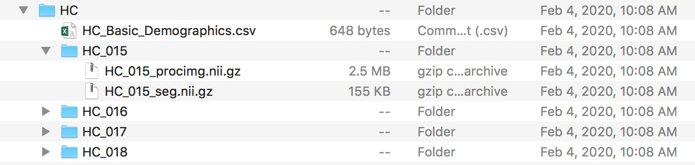
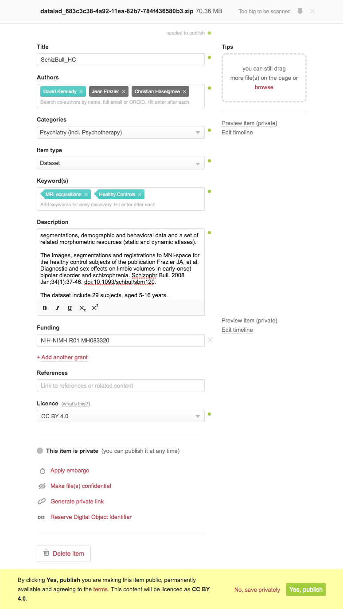
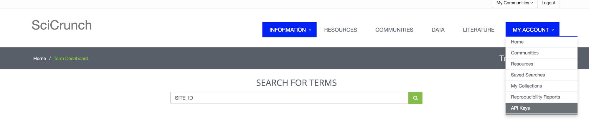
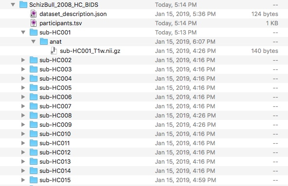

Volume 2: How Would ReproNim Publish a Set of NIfTI Files
---------------------------------------------------------

Version 0.91, published September 3, 2020.

**Change log**

- Version 0.9: published April 6, 2020.
- Version 0.91: published September 3, 2020.  Formatting for Sphinx.

doi: `10.18116/97c1-z931 <https://dx.doi.org/doi:10.18116/97c1-z931>`_

**Summary**

This document teaches:

- How to put a dataset under DataLad control:

    + ``datalad create ...``
    + ``datalad save ...``

- How to "publish" this dataset:

    + ``datalad export-to-figshare ...``

- How to add semantic markup to your demograhpic information

    + ``csv2nidm ...``

- Not only easily citable, but easily shareable (with DataLad install):

    + ``datalad create-sibling-github ...``

- What you gain from the ReproNim Way:

    + Ease of sharability and publication
    + Complete description and machine readability

**Overview**

- :ref:`vol2_problem_statement`
- :ref:`vol2_repronim_solution`
- :ref:`vol2_costs`
- :ref:`vol2_gains`
- :ref:`vol2_conclusion`

**Stakeholder**: Stakeholder: End User (Data Acquirer)

.. _vol2_problem_statement:

Problem Statement
^^^^^^^^^^^^^^^^^

I have a tar file of NIfTI files and csv file of subject demographics of some imaging data that I currently share at NITRC. I would like to ‘publish’ this data in a Findable, Accessible, Interoperable and Reusable (FAIR) way. How can ReproNim Help?

**NOTE:** In this example, we do not really want you to follow along
explicitly, *you* do not need to republish *this* dataset. However, this
guide to how we did this will hopefully serve to assist you in
publishing a dataset of your own.

In this example we use shared data from the `CANDIShare
Project <https://www.nitrc.org/projects/candi_share>`__, imaging data
release for `(Frazier et al.
2008) <https://pubmed.ncbi.nlm.nih.gov/18003631/>`__. Overall in this project
there are 103 structural scans (T1) for children released as 4 tarballs
of .nii files, containing the imaging data for the Healthy Controls,
Bipolar with psychosis, Bipolar without psychosis, and Schizophrenia
Spectrum disorder, respectively. For this example, we will use just the
Healthy Control version 1.1 data, available at this
`link <https://www.nitrc.org/frs/download.php/3703/SchizBull_2008_HC_segimg.tar.gz>`__.
This tar file also includes a .csv demographics file containing
information of the following type:

======= ====== ==== ==========
Subject Gender Age  Handedness
======= ====== ==== ==========
HC_001  male   13.5 RH
HC_002  male   13.4 RH
HC_003  male   6.2  RH
...                 
======= ====== ==== ==========

.. _vol2_repronim_solution:

ReproNim Solution
^^^^^^^^^^^^^^^^^

In theory
"""""""""

Given that the goal here is to ‘publish’ this, in other words make the
data available to others, we can solve this in a couple of ways using
ReproNim tools.

**Minimum Solution:** Put the data (unpacked tar file and demographics
file) under DalaLad control, and use the DataLad publish functionality.
The problem with the minimum solution is that the data is not ‘self
describing’ and hence will require significant explanation about content
of the shared information.

**Intermediate Solution**: Use standardized representations for the
data. Specifically, use the **BIDS** representation for the imaging
data, so that the types of data and file layout is clear. Use the
**NIDM** representation for the demographic content, so that the meaning
of the various demographic fields are self describing. Doing one of the
other of these standardizations is an improvement over the minimum
solution. Then, put this data under DataLad control and use the DataLad
‘publish’ functionality.

**Ideal Solution:** Do both BIDS and NIDM representations of the data,
creating a **ReproBIDS** representation for maximal interpretability of
the shared data. Then, put this data under DataLad control and use the
DataLad ‘publish’ functionality.

In Practice: The Gory Details
"""""""""""""""""""""""""""""

OK, we can do this!

I have a folder, it has my demographics file (HC_Basic_Demographics.csv)
and a subfolder for each of my 29 subjects (<subject>). Each subfolder
has a pair of NIfTI files, <subject>_procimg.nii.gz (a spatially
normalized (to MNI152 space) and cropped T1-weighted structural scan))
and <subject>_seg.nii.gz (a semi-manual segmentation result (from CMA),
fill values representing structures as decoded
`here <https://www.nitrc.org/docman/view.php/377/1035/seg_fill_values.txt>`__).
See the following Figure.

Minimum Solution
^^^^^^^^^^^^^^^^

I can just put this folder under DataLad control.

Do you have DataLad? (Need to install DataLad? See
`here <https://www.datalad.org/get_datalad.html>`__.) I do

.. code-block:: bash

    > datalad --version
    datalad 0.12.2

Is that up to date? Check
`here <https://github.com/datalad/datalad/releases>`__.

In the HC directory, lets create the DataLad dataset with the existing
content:

.. code-block:: bash

    > datalad create --force
    [INFO ] Creating a new annex repo at
    /Users/davidkennedy/Downloads/SchizBull_2008/HC/HC_publish
    **create** (**ok**): /Users/davidkennedy/Downloads/SchizBull_2008/HC (**dataset**)

And now we add our content into this dataset [1]_:

.. code-block:: bash

    > datalad save -m "adding all my HC data"
    **add** (**ok**): .DS_Store (**file**)
    **add** (**ok**): HC_001/HC_001_procimg.nii.gz (**file**)
    **add** (**ok**): HC_001/HC_001_seg.nii.gz (**file**)
    **add** (**ok**): HC_002/HC_002_procimg.nii.gz (**file**)
    **add** (**ok**): HC_002/HC_002_seg.nii.gz (**file**)
    **add** (**ok**): HC_003/HC_003_procimg.nii.gz (**file**)
    **add** (**ok**): HC_003/HC_003_seg.nii.gz (**file**)
    **...**
    **add** (**ok**): HC_Basic_Demographics.csv (**file**)
    **save** (**ok**): . (**dataset**)
    action summary:
      add (ok: 60)
      save (ok: 1)

Great, now we have the HC dataset in DataLad! Let’s publish it. In this
case, we are using `FigShare <https://figshare.com/>`__ as our
publication target (many other publication targets could be used by
DataLad, see the `DataLad Handbook “VIII - Third party
infrastructure” <http://handbook.datalad.org/en/latest/basics/basics8toc.html>`__).
You should create an account there if you wish to follow this example.
There are numerous other publication targets, consult the DataLad
documentation.

.. code-block:: bash

    > datalad export-to-figshare
    [INFO ] Exporting current tree as an archive under /Users/davidkennedy/Downloads/SchizBull_2008/SchizBull_HC since figshare does not support directories
    [INFO ] Uploading /Users/davidkennedy/Downloads/SchizBull_2008/SchizBull_HC/datalad_683c3c38-4a92-11ea-82b7-784f436580b3.zip to figshare
    Article
    **Would you like to create a new article to upload to? If not - we will list existing articles (choices: yes, no): yes**
    [INFO ] Created a new (private) article 11857593 at https://figshare.com/account/articles/11857593. Please visit it, enter additional meta-data and make public
    /Users/davidkennedy/Downloads/SchizBull_2008/SchizBull_HC/datalad_683c3c38-4a92-/Users/davidkennedy/Downloads/SchizBull_2008/SchizBull_HC/datalad_683c3c38-4a92-/Users/davidkennedy/Downloads/SchizBull_2008/SchizBull_HC/datalad_683c3c38-4a92-/Users/davidkennedy/Downloads/SchizBull_2008/SchizBull_HC/datalad_683c3c38-4a92-/Users/davidkennedy/Downloads/SchizBull_2008/SchizBull_HC/datalad_683c3c38-4a92-/Users/davidkennedy/Downloads/SchizBull_2008/SchizBull_HC/datalad_683c3c38-4a92-/Users/davidkennedy/Downloads/SchizBull_2008/SchizBull_HC/datalad_683c3c38-4a92-/Users/davidkennedy/Downloads/SchizBull_2008/SchizBull_HC/datalad_683c3c38-4a92-/Users/davidkennedy/Downloads/SchizBull_2008/SchizBull_HC/datalad_683c3c38-4a92-
    [INFO ] 'Registering'
    /Users/davidkennedy/Downloads/SchizBull_2008/SchizBull_HC/datalad_683c3c38-4a92-11ea-82b7-784f436580b3.zip within annex
    [INFO ] Adding URL https://ndownloader.figshare.com/files/21732114 for
    it
    [INFO ] Registering links back for the content of the archive
    [INFO ] Adding content of the archive
    /Users/davidkennedy/Downloads/SchizBull_2008/SchizBull_HC/datalad_683c3c38-4a92-11ea-82b7-784f436580b3.zip into annex <AnnexRepo path=/Users/davidkennedy/Downloads/SchizBull_2008/SchizBull_HC (<class 'datalad.support.annexrepo.AnnexRepo'>)>
    [INFO ] Initiating special remote datalad-archives
    [INFO ] Finished adding
    /Users/davidkennedy/Downloads/SchizBull_2008/SchizBull_HC/datalad_683c3c38-4a92-11ea-82b7-784f436580b3.zip:
    Files processed: 63, removed: 63, +git: 2, +annex: 61
    [INFO ] Removing generated and now registered in annex archive
    **export_to_figshare** (**ok**): <Dataset path=/Users/davidkennedy/Downloads/SchizBull_2008/SchizBull_HC>
    [Published archive https://ndownloader.figshare.com/files/21732114]

Now, you simply log into your FigShare account, go to ‘my data’ and
select the content you just uploaded. Initially, this content is private
only to you. You now need to update the metadata and information about
the content so that you can select ‘publish’, thereby making this
publicly accessible and generating a DOI.

Voila! You’ve just published that dataset.

   **Kennedy, David; Frazier, Jean; Haselgrove, Christian (2020):
   SchizBull_HC. figshare. Dataset.
   https://doi.org/10.6084/m9.figshare.11857593.v1**

Intermediate Solution
^^^^^^^^^^^^^^^^^^^^^

We can improve the above solution by representing our two types of data
(images and demographics) in a more self-describing representation. We
look at each of these topics in the next sections.

Behavioral Data to NIDM
'''''''''''''''''''''''

`NIDM <http://nidm.nidash.org/>`__ is a Semantic Web based metadata
standard that helps capture and describe experimental data, analytic
workflows and statistical results via the provenance of the data. NIDM
uses consistent data descriptors in the form of machine accessible
terminology, and a formal, extensible data model, which enables rich
aggregation and query across datasets and domains.

When behavioral data is stored in a ‘comma separated variable’ (.csv)
file, ReproNim has provided a tool to support the representation of this
information in the NIDM format. Specifically, **‘csv2nidm’** supports
this conversion. To use this tool, we need
`PyNIDM <https://github.com/incf-nidash/PyNIDM>`__.

Do you have PyNIDM? (Need to install PyNIDM? For full details see
`here <https://github.com/incf-nidash/PyNIDM#dependencies>`__.)

In most cases you can Open terminal window and install it into your
Python environment with pip.

.. code-block:: bash

    > pip install pynidm

Within **PyNIDM** is the **csv2nidm** tool we will want to use. csv2nidm
uses the
`InterLex <https://www.scicrunch.org/scicrunch/interlex/dashboard>`__
API. To use this, we need each user to have an API key. We get this by
doing the following:

   Goto: https://scicrunch.org/scicrunch/interlex/dashboard

i.  Click ’login’ in upper right corner

    1. If you do not have an InterLex account, click ‘Register’...

ii. Once logged in click “MyAccount” -> API Keys

iii. Re-authorize; click generate_an_API button

iv.  Copy your newly created key and add it as an environment variable
        in your system called INTERLEX_API_KEY to use in the next steps

Identify your CSV file to annotate: HC_Basic_Demographics.csv. In this
case, the CSV file should contain 1 row of variable names which should
be the first row of the file. Each subsequent row is the data for your
participants.

From a terminal window:

.. code-block:: bash

    > csv2nidm -csv [YOUR CSV FILE.csv] -out [YOUR OUTPUT FILE.ttl]

Iterate through selecting terms from InterLex or changing your search
string.

Example session below:

.. code-block:: bash

    /Users/davidkennedy/miniconda3/envs/pynidm_py3/lib/python3.8/site-packages/fuzzywuzzy/fuzz.py:11:
    UserWarning: Using slow pure-python SequenceMatcher. Install python-Levenshtein to remove this warning
    warnings.warn('Using slow pure-python SequenceMatcher. Install python-Levenshtein to remove this warning')
    json mapping file not supplied

    Query String: Subject

    InterLex Terms (CDEs):
    1: Label: Research Subject Definition: Preferred URL:
    http://uri.interlex.org/base/ilx_0275874
    2: Label: EEG Subject Definition: Preferred URL:
    http://uri.interlex.org/base/ilx_0158344
    3: Label: SSC-Subject Definition: Preferred URL:
    http://uri.interlex.org/base/ilx_0279232
    4: Label: Genomics Subject Definition: Preferred URL:
    http://uri.interlex.org/base/ilx_0173074
    5: Label: blood_id (Research Subject) Definition: blood ID Preferred
    URL: http://uri.interlex.org/NDA/uris/datadictionary/elements/2023754
    6: Label: gender (Research Subject) Definition: Sex of the subject
    Preferred URL:
    http://uri.interlex.org/NDA/uris/datadictionary/elements/2023716
    7: Label: agre_subject_id (Research Subject) Definition: AGRE subject ID
    Preferred URL:
    http://uri.interlex.org/NDA/uris/datadictionary/elements/2023750
    8: Label: cpea_site (Research Subject) Definition: CPEA/STAART site name
    Preferred URL:
    http://uri.interlex.org/NDA/uris/datadictionary/elements/2023752
    9: Label: src_sibling4_id (Research Subject) Definition: site specific
    sibling4 ID Preferred URL:
    http://uri.interlex.org/NDA/uris/datadictionary/elements/2023739
    10: Label: physiological_responses_type (Research Subject) Definition:
    Description of monitored physiological responses Preferred URL:
    http://uri.interlex.org/NDA/uris/datadictionary/elements/2214398

    NIDM Terms:
    11: Label(NIDM Term): In-vivo Subject Definition: None URL:
    http://www.owl-ontologies.com/Ontology1298855822.owl#In_vivo_subject
    12: Label(NIDM Term): In-vitro Subject Definition: None URL:
    http://www.owl-ontologies.com/Ontology1298855822.owl#In_vitro_subject
    13: Label(NIDM Term): Ex-vivo Subject Definition: None URL:
    http://www.owl-ontologies.com/Ontology1298855822.owl#Ex_vivo_subject
    14: Broaden Interlex query
    15: Change Interlex query string from: "Subject"
    16: Define my own term for this variable
    ---------------------------------------------------------------------------------------
    **Please select an option (1:16) from above: 11**
    Stored mapping Column: DD(source='HC_Basic_Demographics.csv',
    variable='Subject') ->
    Label: In-vivo Subject
    Definition: None
    Url:
    http://www.owl-ontologies.com/Ontology1298855822.owl#In_vivo_subject
    ---------------------------------------------------------------------------------------
    json mapping file not supplied

    Query String: Gender

    InterLex Terms (CDEs):
    1: Label: srs_gender (AGRE SRS Child 2002) Definition: Child Gender
    Preferred URL:
    http://uri.interlex.org/NDA/uris/datadictionary/elements/2024502
    2: Label: childgen (Developmental Assessment of Children from Spanish
    Speaking Families) Definition: Child gender Preferred URL:
    http://uri.interlex.org/NDA/uris/datadictionary/elements/2074946
    3: Label: revadult_gendertotal (Reading the Mind in the Eyes Task
    (RMET)) Definition: Gender Total Preferred URL:
    http://uri.interlex.org/NDA/uris/datadictionary/elements/2031140
    4: Label: sclgender (Family History Epidemiologic) Definition:
    respondent's gender Preferred URL:
    http://uri.interlex.org/NDA/uris/datadictionary/elements/2135520
    5: Label: nimh_rv_dem_03 (NIMH RV Demographics) Definition: Current
    gender identity Preferred URL:
    http://uri.interlex.org/NDA/uris/datadictionary/elements/2200082
    6: Label: ques_gender6 (PQ Demographics) Definition: Gender -Sibling 6
    Preferred URL:
    http://uri.interlex.org/NDA/uris/datadictionary/elements/2165574
    7: Label: ques_gender4 (Medical Demographics) Definition: Gender
    -Sibling 4 Preferred URL:
    http://uri.interlex.org/NDA/uris/datadictionary/elements/2041879
    8: Label: bio_childgender_5 (Prenatal and Early Postnatal History)
    Definition: Biological child gender Preferred URL:
    http://uri.interlex.org/NDA/uris/datadictionary/elements/2144405
    9: Label: resp_sex (Side Effects) Definition: gender of respondent
    Preferred URL:
    http://uri.interlex.org/NDA/uris/datadictionary/elements/2188889
    10: Label: resp_sex (Swanson, Nolan and Pelham SNAP-IV Rating Scale)
    Definition: gender of respondent Preferred URL:
    http://uri.interlex.org/NDA/uris/datadictionary/elements/2188890

    NIDM Terms:
    11: Label(NIDM Term): generic name Definition: None URL:
    http://semanticscience.org/resource/SIO_000077
    12: Broaden Interlex query
    13: Change Interlex query string from: "Gender"
    14: Define my own term for this variable
    ---------------------------------------------------------------------------------------
    **Please select an option (1:14) from above: 12**

    Query String: Gender

    InterLex Terms (CDEs):
    1: Label: childgen (Developmental Assessment of Children from Spanish
    Speaking Families) Definition: Child gender Preferred URL:
    http://uri.interlex.org/NDA/uris/datadictionary/elements/2074946
    2: Label: srs_gender (AGRE SRS Child 2002) Definition: Child Gender
    Preferred URL:
    http://uri.interlex.org/NDA/uris/datadictionary/elements/2024502
    3: Label: childgen (Family and Child Background Questionnaire)
    Definition: Child gender Preferred URL:
    http://uri.interlex.org/NDA/uris/datadictionary/elements/2188059
    4: Label: sclgender (Child Behavior Checklist (CBCL) 6-18) Definition:
    respondent's gender Preferred URL:
    http://uri.interlex.org/NDA/uris/datadictionary/elements/2163119
    5: Label: sclgender (Symptom Checklist-90-Revised) Definition:
    respondent's gender Preferred URL:
    http://uri.interlex.org/NDA/uris/datadictionary/elements/2030481
    6: Label: gender_score (Child Eyes Test (2006)) Definition: Gender Score
    Preferred URL:
    http://uri.interlex.org/NDA/uris/datadictionary/elements/1958510
    7: Label: childgen (Parent Demographics Interview) Definition: Child
    gender Preferred URL:
    http://uri.interlex.org/NDA/uris/datadictionary/elements/2134237
    8: Label: childgen (UC Provider Care) Definition: Child gender Preferred
    URL: http://uri.interlex.org/NDA/uris/datadictionary/elements/2062243
    9: Label: ques_gendernotes (CHARGE Family Characteristics Questionnaire)
    Definition: Gender -Notes Preferred URL:
    http://uri.interlex.org/NDA/uris/datadictionary/elements/2030764
    10: Label: sclgender (PQ Demographics) Definition: respondent's gender
    Preferred URL:
    http://uri.interlex.org/NDA/uris/datadictionary/elements/2070294
    se
    InterLex Terms (PDEs):
    11: Label: Gender Definition: temporary definition of gender Preferred
    URL: http://uri.interlex.org/base/ilx_0738263

    NIDM Terms:
    12: Label(NIDM Term): generic name Definition: None URL:
    http://semanticscience.org/resource/SIO_000077
    13: Narrow Interlex query
    14: Change Interlex query string from: "Gender"
    15: Define my own term for this variable
    ---------------------------------------------------------------------------------------
    **Please select an option (1:15) from above: 14**
    **Please input new search term for CSV column: Gender :sex**
    ---------------------------------------------------------------------------------------

    Query String: sex

    InterLex Terms (CDEs):
    1: Label: Sex Definition: The difference between male and female, based
    upon the interactions between genes and between the genotype and the
    environment. Genotype is identified based on the individual's
    reproductive organs and functions assigned by chromosomal complement.
    Preferred URL: http://uri.interlex.org/base/ilx_0112866
    2: Label: ORGM SEX Definition: Sex Preferred URL:
    http://uri.interlex.org/base/ilx_0112844
    3: Label: Animal sex type Definition: Type of animal species sex as
    determined by observation Preferred URL:
    http://uri.interlex.org/base/ilx_0383307
    4: Label: relsex (Family Contacts) Definition: relative sex Preferred
    URL: http://uri.interlex.org/NDA/uris/datadictionary/elements/2085341
    5: Label: relsex (Family History) Definition: relative sex Preferred
    URL: http://uri.interlex.org/NDA/uris/datadictionary/elements/2130113
    6: Label: Sex of animal participant/subject genotype type Definition:
    Sex chromosomes of the animal participant/subject based upon genotyping
    Preferred URL: http://uri.interlex.org/base/ilx_0383305
    7: Label: psm4rosb (Psychosocial Interview) Definition: Relationships
    with opposite sex - having sex with many Preferred URL:
    http://uri.interlex.org/NDA/uris/datadictionary/elements/2110827
    8: Label: srd9_2 (Self-Reported Delinquency) Definition: had unsafe sex
    Preferred URL:
    http://uri.interlex.org/NDA/uris/datadictionary/elements/2116623
    9: Label: rel_same_sex (ACS Post Stratification Weights) Definition:
    Same sex twin Preferred URL:
    http://uri.interlex.org/NDA/uris/datadictionary/elements/2264317
    10: Label: aesa7f (Adverse Events) Definition: Sex Drive: Have you had
    any problems with your sex drive? (Severe = no interest in sex)
    Preferred URL:
    http://uri.interlex.org/NDA/uris/datadictionary/elements/2114063
    11: Narrow Interlex query
    12: Change Interlex query string from: "sex"
    13: Define my own term for this variable
    ---------------------------------------------------------------------------------------
    **Please select an option (1:13) from above: 1**
    Stored mapping Column: DD(source='HC_Basic_Demographics.csv',
    variable='Gender') ->
    Label: Sex
    Definition: The difference between male and female, based upon the
    interactions between genes and between the genotype and the environment.
    Genotype is identified based on the individual's reproductive organs and
    functions assigned by chromosomal complement.
    Url: http://uri.interlex.org/base/ilx_0112866
    ---------------------------------------------------------------------------------------
    json mapping file not supplied

    Query String: Age

    InterLex Terms (CDEs):
    1: Label: Participant Age Definition: Age at the time of study
    enrollment, expressed in number of years completed at the last birthday.
    Preferred URL: http://uri.interlex.org/base/ilx_0115067
    2: Label: age (Omnibus) Definition: Age (years: months: days) Preferred
    URL: http://uri.interlex.org/NDA/uris/datadictionary/elements/2109856
    3: Label: Age Differentiation Test Definition: Preferred URL:
    http://uri.interlex.org/base/ilx_0345066
    4: Label: age (Vital Signs) Definition: Age (years: months: days)
    Preferred URL:
    http://uri.interlex.org/NDA/uris/datadictionary/elements/2079580
    5: Label: adt36_a_female_rtcr (Age Differentiation Test) Definition:
    Response Time for Correct Females Trials (ms) Preferred URL:
    http://uri.interlex.org/NDA/uris/datadictionary/elements/2101002
    6: Label: adt36_a_pct10_cr (Age Differentiation Test) Definition:
    Correct Responses for Age Differentiation Test 10 Percent Preferred URL:
    http://uri.interlex.org/NDA/uris/datadictionary/elements/2101003
    7: Label: adt36_a_ca_rtcr (Age Differentiation Test) Definition:
    Response Time for Correct Caucasian Trials (ms) Preferred URL:
    http://uri.interlex.org/NDA/uris/datadictionary/elements/2101019
    8: Label: adt36_a_female_cr (Age Differentiation Test) Definition:
    Correct Responses for Females Trials Preferred URL:
    http://uri.interlex.org/NDA/uris/datadictionary/elements/2101001
    9: Label: adt36_a_nonca_rtcr (Age Differentiation Test) Definition:
    Response Time for Correct Non-Caucasian Trials (ms) Preferred URL:
    http://uri.interlex.org/NDA/uris/datadictionary/elements/2101023
    10: Label: adt36_a_cnt_200 (Age Differentiation Test) Definition: Total
    Count Under 200 (ms) Preferred URL:
    http://uri.interlex.org/NDA/uris/datadictionary/elements/2101027

    NIDM Terms:
    11: Label(NIDM Term): name Definition: None URL:
    http://semanticscience.org/resource/SIO_000116
    12: Label(NIDM Term): race Definition: None URL:
    http://semanticscience.org/resource/SIO_001015
    13: Label(NIDM Term): age Definition: None URL:
    http://semanticscience.org/resource/SIO_001013
    14: Label(NIDM Term): male Definition: A biological sex quality inhering
    in an individual or a population whose sex organs contain only male
    gametes. URL: http://purl.obolibrary.org/obo/PATO_0000384
    15: Broaden Interlex query
    16: Change Interlex query string from: "Age"
    17: Define my own term for this variable
    ---------------------------------------------------------------------------------------
    **Please select an option (1:17) from above: 1**
    Stored mapping Column: DD(source='HC_Basic_Demographics.csv',
    variable='Age') ->
    Label: Participant Age
    Definition: Age at the time of study enrollment, expressed in number of
    years completed at the last birthday.
    Url: http://uri.interlex.org/base/ilx_0115067
    ---------------------------------------------------------------------------------------
    json mapping file not supplied

    Query String: Handedness

    InterLex Terms (CDEs):
    1: Label: behavioralobservations_hand (Pattern Comparison Processing
    Speed) Definition: Handedness Preferred URL:
    http://uri.interlex.org/NDA/uris/datadictionary/elements/2151473
    2: Label: handedness (Tool Use Task) Definition: handedness Preferred
    URL: http://uri.interlex.org/NDA/uris/datadictionary/elements/2224214
    3: Label: sum2_hand (The Comprehensive Affect Testing System)
    Definition: Handedness Preferred URL:
    http://uri.interlex.org/NDA/uris/datadictionary/elements/2211293
    4: Label: behavioralobservations_hand (Cognition Composite Scores)
    Definition: Handedness Preferred URL:
    http://uri.interlex.org/NDA/uris/datadictionary/elements/2151328
    5: Label: handedness (Wechsler Intelligence Scale for Children III)
    Definition: handedness Preferred URL:
    http://uri.interlex.org/NDA/uris/datadictionary/elements/2045124
    6: Label: handedness (WASI-2) Definition: handedness Preferred URL:
    http://uri.interlex.org/NDA/uris/datadictionary/elements/2043074
    7: Label: handedness (Affective Disorders Evaluation) Definition:
    handedness Preferred URL:
    http://uri.interlex.org/NDA/uris/datadictionary/elements/2084388
    8: Label: handedness (Cannabis Withdrawal Scale) Definition: handedness
    Preferred URL:
    http://uri.interlex.org/NDA/uris/datadictionary/elements/2097018
    9: Label: handedness (Judgment of Line Orientation - Form H) Definition:
    handedness Preferred URL:
    http://uri.interlex.org/NDA/uris/datadictionary/elements/1955041
    10: Label: handedness (Demographics) Definition: handedness Preferred
    URL: http://uri.interlex.org/NDA/uris/datadictionary/elements/2132569

    NIDM Terms:
    11: Label(NIDM Term): right handedness Definition: Handedness where the
    organism preferentially uses the right hand or foot for tasks requiring
    the use of a single hand or foot or a dominant hand or foot. URL:
    http://purl.obolibrary.org/obo/PATO_0002203
    12: Label(NIDM Term): handedness Definition: A behavioral quality
    inhering ina bearer by virtue of the bearer's unequal distribution of
    fine motor skill between its left and right hands or feet. URL:
    http://purl.obolibrary.org/obo/PATO_0002201
    13: Label(NIDM Term): ambidextrous handedness Definition: Handedness
    where the organism exhibits no overall dominance in the use of right or
    left hand or foot in the performance of tasks that require one hand or
    foot or a dominant hand or foot. URL:
    http://purl.obolibrary.org/obo/PATO_0002204
    14: Label(NIDM Term): left handedness Definition: Handedness where the
    organism preferentially uses the left hand or foot for tasks requiring
    the use of a single hand or foot or a dominant hand or foot. URL:
    http://purl.obolibrary.org/obo/PATO_0002202
    15: Broaden Interlex query
    16: Change Interlex query string from: "Handedness"
    17: Define my own term for this variable
    ---------------------------------------------------------------------------------------
    **Please select an option (1:17) from above: 12**
    Stored mapping Column: DD(source='HC_Basic_Demographics.csv',
    variable='Handedness') ->
    Label: handedness
    Definition: A behavioral quality inhering ina bearer by virtue of the
    bearer's unequal distribution of fine motor skill between its left and
    right hands or feet.
    Url: http://purl.obolibrary.org/obo/PATO_0002201
    ---------------------------------------------------------------------------------------
    Creating NIDM file...
    1: Subject
    2: Gender
    3: Age
    4: Handedness
    **Please select the subject ID field from the list above: 1**
    Writing NIDM file....
    (pynidm_py3)

I now have my NIDM file (HC.ttl) and a JSON file (HC.json). We want the
NIDM file for query and the JSON file if you may want to be able to
re-convert your CSV in the future without going through all the variable
mapping procedure again. Add these files to he datalad control:

.. code-block:: bash

    > datalad save -m "Added NIDM representation of this dataset"
    **add** (**ok**): HC.json (**file**)
    **add** (**ok**): HC.ttl (**file**)
    **save** (**ok**): . (**dataset**)
    action summary:
      add (ok: 2)
      save (ok: 1)

We can publish this, as above, with the “raw images plus NIDM
demographics”.

.. code-block:: bash

    > datalad export-to-figshare
    [INFO ] Exporting current tree as an archive under /Users/davidkennedy/Downloads/SchizBull_2008/SchizBull_HC since figshare does not support directories
    [INFO ] Uploading /Users/davidkennedy/Downloads/SchizBull_2008/SchizBull_HC/datalad_683c3c38-4a92-11ea-82b7-784f436580b3.zip to figshare
    Article
    **Would you like to create a new article to upload to? If not - we will list existing articles (choices: yes, no): no**
    11857593 https://api.figshare.com/v2/account/articles/11857593 - SchizBull_HC
    9943046 https://api.figshare.com/v2/account/articles/9943046 - reprokwyk Re-Executable Example
    **Which of the articles should we upload to. (choices: 11857593,
    9943046): 11857593**
    /Users/davidkennedy/Downloads/SchizBull_2008/SchizBull_HC/datalad_683c3c38-4a92-/Users/davidkennedy/Downloads/SchizBull_2008/SchizBull_HC/datalad_683c3c38-4a92-/Users/davidkennedy/Downloads/SchizBull_2008/SchizBull_HC/datalad_683c3c38-4a92-/Users/davidkennedy/Downloads/SchizBull_2008/SchizBull_HC/datalad_683c3c38-4a92-/Users/davidkennedy/Downloads/SchizBull_2008/SchizBull_HC/datalad_683c3c38-4a92-/Users/davidkennedy/Downloads/SchizBull_2008/SchizBull_HC/datalad_683c3c38-4a92-/Users/davidkennedy/Downloads/SchizBull_2008/SchizBull_HC/datalad_683c3c38-4a92-/Users/davidkennedy/Downloads/SchizBull_2008/SchizBull_HC/datalad_683c3c38-4a92-/Users/davidkennedy/Downloads/SchizBull_2008/SchizBull_HC/datalad_683c3c38-4a92-/Users/davidkennedy/Downloads/SchizBull_2008/SchizBull_HC/datalad_683c3c38-4a92-
    [INFO ] 'Registering' /Users/davidkennedy/Downloads/SchizBull_2008/SchizBull_HC/datalad_683c3c38-4a92-11ea-82b7-784f436580b3.zip within annex
    [INFO ] Adding URL https://ndownloader.figshare.com/files/21732456 for it
    [INFO ] Registering links back for the content of the archive
    [INFO ] Adding content of the archive /Users/davidkennedy/Downloads/SchizBull_2008/SchizBull_HC/datalad_683c3c38-4a92-11ea-82b7-784f436580b3.zip into annex <AnnexRepo path=/Users/davidkennedy/Downloads/SchizBull_2008/SchizBull_HC (<class 'datalad.support.annexrepo.AnnexRepo'>)>
    [INFO ] Finished adding /Users/davidkennedy/Downloads/SchizBull_2008/SchizBull_HC/datalad_683c3c38-4a92-11ea-82b7-784f436580b3.zip: Files processed: 65, removed: 65, +git: 2, +annex: 63
    [INFO ] Removing generated and now registered in annex archive
    **export_to_figshare** (**ok**): <Dataset path=/Users/davidkennedy/Downloads/SchizBull_2008/SchizBull_HC>
    [Published archive https://ndownloader.figshare.com/files/21732456]

So, there are some interesting things to note here. First, since we had
already published a version of this, we opted to add this content to the
previous ‘article’. We can release this updated version as Version 2.
There is some handling in FigShare necessary to generate the Version 2
release. Specifically, you have to edit the release, delete the original
zip file, retaining only the most recent zip file, and ‘publish again’
as a new version. You can also update the description/abstract/authors,
etc. if needed.

NIfTI Images to BIDS
''''''''''''''''''''

`BIDS <https://bids.neuroimaging.io/>`__ is a standard prescribing a
formal way to name and organize neuroimaging data and metadata in a file
system that simplifies communication and collaboration between users,
and enables easier data validation and software development through
using consistent paths and naming for data files.

At the moment, there are no ‘simple’ convert NIfTI data to BIDS tools.
It is essentially a “Do It Yourself (DIY)” situation between the
investigators and the NIfTI data they have. The BIDS specification is
`here <https://bids-specification.readthedocs.io/en/stable/>`__. Good
Luck! The details of this transformation are beyond the scope of this
article, so for the sake of this discussion. Also, for simplicity, we
are only considering the structural (anat/sub-HC*_T1w.nii.gz) subset of
the data, as handling the *‘cardviews* segmentation results
(HC*_seg.nii.gz)’ from the original release would also require handling
this data in the ‘BIDS derivatives’ section of the BIDS spec, a task for
a more advanced chapter of this volume). I now have a BIDS compliant
version of the NIfTI data:

It generates some warnings at the `BIDS
Validator <https://bids-standard.github.io/bids-validator/>`__, but is
otherwise valid BIDS.

As above, we can put this under DataLad control:

.. code-block:: bash

    > datalad save -m "Added NIDM representation of this dataset"

You could publish this: BIDS (the original demographic information is
not in the participants.tsv file).

.. code-block:: bash

    > datalad export-to-figshare
    [INFO ] Exporting current tree as an archive under /Users/davidkennedy/Data/SchizBull/SchizBull_2008_HC_BIDS since figshare does not support directories
    [INFO ] Uploading /Users/davidkennedy/Data/SchizBull/SchizBull_2008_HC_BIDS/datalad_513b5ec6-191a-11e9-8a25-784f436580b3.zip to figshare
    Article
    **Would you like to create a new article to upload to? If not - we will list existing articles (choices: yes, no): no**
    11857593 https://api.figshare.com/v2/account/articles/11857593 - SchizBull_HC
    9943046 https://api.figshare.com/v2/account/articles/9943046 - reprokwyk Re-Executable Example
    **Which of the articles should we upload to. (choices: 11857593, 9943046): 11857593**
    /Users/davidkennedy/Data/SchizBull/SchizBull_2008_HC_BIDS/datalad_513b5ec6-191a-/Users/davidkennedy/Data/SchizBull/SchizBull_2008_HC_BIDS/datalad_513b5ec6-191a-/Users/davidkennedy/Data/SchizBull/SchizBull_2008_HC_BIDS/datalad_513b5ec6-191a-/Users/davidkennedy/Data/SchizBull/SchizBull_2008_HC_BIDS/datalad_513b5ec6-191a-/Users/davidkennedy/Data/SchizBull/SchizBull_2008_HC_BIDS/datalad_513b5ec6-191a-/Users/davidkennedy/Data/SchizBull/SchizBull_2008_HC_BIDS/datalad_513b5ec6-191a-/Users/davidkennedy/Data/SchizBull/SchizBull_2008_HC_BIDS/datalad_513b5ec6-191a-
    [INFO ] 'Registering' /Users/davidkennedy/Data/SchizBull/SchizBull_2008_HC_BIDS/datalad_513b5ec6-191a-11e9-8a25-784f436580b3.zip within annex
    [INFO ] Adding URL https://ndownloader.figshare.com/files/21733017 for it
    [INFO ] Registering links back for the content of the archive
    [INFO ] Adding content of the archive /Users/davidkennedy/Data/SchizBull/SchizBull_2008_HC_BIDS/datalad_513b5ec6-191a-11e9-8a25-784f436580b3.zip into annex <AnnexRepo path=/Users/davidkennedy/Data/SchizBull/SchizBull_2008_HC_BIDS (<class 'datalad.support.annexrepo.AnnexRepo'>)>
    [INFO ] Initiating special remote datalad-archives
    [INFO ] Finished adding /Users/davidkennedy/Data/SchizBull/SchizBull_2008_HC_BIDS/datalad_513b5ec6-191a-11e9-8a25-784f436580b3.zip:
    Files processed: 41, removed: 41, +git: 2, +annex: 39
    [INFO ] Removing generated and now registered in annex archive
    **export_to_figshare** (**ok**): <Dataset path=/Users/davidkennedy/Data/SchizBull/SchizBull_2008_HC_BIDS>
    [Published archive https://ndownloader.figshare.com/files/21733017]

As above, this version was added to the FigShare ‘article’. You now need
to go into the FigShare article, edit/update the the release as needed
(remove old archive), etc. and save/publish new version.

**OK, Version 3 published!**

Ideal Solution
^^^^^^^^^^^^^^

Well, now that you’ve taken the original image and demographics content,
and expressed them both in the appropriate ‘standard’ and published each
of these variants separately (Version 1 = plain old NIfTI files; Version
2 = plain old NIfTI files plus NIDM demographics; Version 3 = BIDS
representation of the imaging data), the ReproNim recommendation is to
combine these standards to generate a ReproBIDS version of the data. To
do this, we simply add the NIDM files to the BIDS structure. We copy the
.ttl file to nidm.ttl in the top level of the BIDS file structure (keep
the .json file for future use of you convert similar csv demographics
files in the future); and update the .bidsignore file to exclude the the
nidm.ttl file, in order to retain our valid BIDS representation.

Now, update the DataLad:

.. code-block:: bash

    > datalad save -m “adding the NIDM demographics and updated .bidsignore”
    **add** (**ok**): nidm.ttl (**file**)
    **save** (**ok**): . (**dataset**)
    action summary:
      add (ok: 1)
      save (ok: 1)

And publish!

.. code-block:: bash

    > datalad export-to-figshare
    [INFO ] Exporting current tree as an archive under
    /Users/davidkennedy/Data/SchizBull/SchizBull_2008_HC_BIDS since figshare
    does not support directories
    [INFO ] Uploading
    /Users/davidkennedy/Data/SchizBull/SchizBull_2008_HC_BIDS/datalad_513b5ec6-191a-11e9-8a25-784f436580b3.zip
    to figshare
    Article
    **Would you like to create a new article to upload to? If not - we will
    list existing articles (choices: yes, no): no**
    11857593 https://api.figshare.com/v2/account/articles/11857593 -
    SchizBull_HC
    9943046 https://api.figshare.com/v2/account/articles/9943046 - reprokwyk
    Re-Executable Example
    **Which of the articles should we upload to. (choices: 11857593,
    9943046): 11857593**
    /Users/davidkennedy/Data/SchizBull/SchizBull_2008_HC_BIDS/datalad_513b5ec6-191a-/Users/davidkennedy/Data/SchizBull/SchizBull_2008_HC_BIDS/datalad_513b5ec6-191a-/Users/davidkennedy/Data/SchizBull/SchizBull_2008_HC_BIDS/datalad_513b5ec6-191a-/Users/davidkennedy/Data/SchizBull/SchizBull_2008_HC_BIDS/datalad_513b5ec6-191a-/Users/davidkennedy/Data/SchizBull/SchizBull_2008_HC_BIDS/datalad_513b5ec6-191a-/Users/davidkennedy/Data/SchizBull/SchizBull_2008_HC_BIDS/datalad_513b5ec6-191a-/Users/davidkennedy/Data/SchizBull/SchizBull_2008_HC_BIDS/datalad_513b5ec6-191a-/Users/davidkennedy/Data/SchizBull/SchizBull_2008_HC_BIDS/datalad_513b5ec6-191a-/Users/davidkennedy/Data/SchizBull/SchizBull_2008_HC_BIDS/datalad_513b5ec6-191a-/Users/davidkennedy/Data/SchizBull/SchizBull_2008_HC_BIDS/datalad_513b5ec6-191a-/Users/davidkennedy/Data/SchizBull/SchizBull_2008_HC_BIDS/datalad_513b5ec6-191a-/Users/davidkennedy/Data/SchizBull/SchizBull_2008_HC_BIDS/datalad_513b5ec6-191a-
    [INFO ] 'Registering'
    /Users/davidkennedy/Data/SchizBull/SchizBull_2008_HC_BIDS/datalad_513b5ec6-191a-11e9-8a25-784f436580b3.zip
    within annex
    [INFO ] Adding URL https://ndownloader.figshare.com/files/21738879 for
    it
    [INFO ] Registering links back for the content of the archive
    [INFO ] Adding content of the archive
    /Users/davidkennedy/Data/SchizBull/SchizBull_2008_HC_BIDS/datalad_513b5ec6-191a-11e9-8a25-784f436580b3.zip
    into annex <AnnexRepo
    path=/Users/davidkennedy/Data/SchizBull/SchizBull_2008_HC_BIDS (<class
    'datalad.support.annexrepo.AnnexRepo'>)>
    [INFO ] Finished adding
    /Users/davidkennedy/Data/SchizBull/SchizBull_2008_HC_BIDS/datalad_513b5ec6-191a-11e9-8a25-784f436580b3.zip:
    Files processed: 42, removed: 42, +git: 2, +annex: 40
    [INFO ] Removing generated and now registered in annex archive
    **export_to_figshare** (**ok**): <Dataset
    path=/Users/davidkennedy/Data/SchizBull/SchizBull_2008_HC_BIDS>
    [Published archive https://ndownloader.figshare.com/files/21738879]

publish versus Publish (with a capital P)!
~~~~~~~~~~~~~~~~~~~~~~~~~~~~~~~~~~~~~~~~~~

In the above examples, we’ve used the datalad export-to-figshare as a
proxy for publish. In this case, we have put the data in a publicly
accessible location and generated a unique and citable identifier. So if
someone accessed this data, they could appropriately cite the original
authors (credit), and attribute the source of the data (supporting
transparency of subsequent workflows using this data). If we perform a
FAIR (Findable, Accessible, Interoperable, Reusable) assessment of this
publication, we find that it is (with a good bit of work), *findable* in
the FigShare search, *accessible* (CC By 4.0) via download of the data
file, *interoperable* and *reusable* by virtue of it’s standards (NIfTI,
BIDS and NIDM). So, that’s good, but it could be better. We can increase
the interoperability and reusability by taking one more advantage of the
use of DataLad. In addition to using DataLad to publish (to FigShare),
we can use DataLad to make this datalad object reusable by others in
DataLad. To do this, we can:

.. code-block:: bash

    > datalad create-sibling-github SchizBull_HC
    .: github(-) [https://github.com/dnkennedy/SchizBull_HC.git (git)]
    'https://github.com/dnkennedy/SchizBull_HC.git' configured as sibling 'github' for <Dataset path=/Users/davidkennedy/Data/SchizBull/SchizBull_2008_HC_BIDS>

This associates your local ‘dataset’ with a specific GitHub repo and
creates a placeholder in GitHub. It will ask for your GitHub username
and password. In this example, you will end up with the repo
“SchizBull_HC” in your GitHub account.

.. code-block:: bash

    > datalad publish --to github
    [INFO ] Publishing <Dataset
    path=/Users/davidkennedy/Data/SchizBull/SchizBull_2008_HC_BIDS> to
    github
    Pushing github (resolving stuff): 1%\| \| 2.00/158 [00:00<00:00, 17.8k
    objects/sPushing github (resolving stuff): 7%\| \| 11.0/158
    [00:00<00:00, 56.4k objects/sPushing github (resolving stuff): 8%\| \|
    12.0/158 [00:00<00:00, 46.1k objects/sPushing github (resolving stuff):
    100/158 [00:00<00:00, 1.07k objects/s]
    **publish** (**ok**): . (**dataset**) [pushed to github: ['[new branch]', '[new branch]']]

This command will propagate your local information into the above
associated GitHub repo. The benefit of this procedure is that anyone can
now ‘datalad install’ this dataset for subsequent reuse:

.. code-block:: bash

    > datalad install https://github.com/dnkennedy/SchizBull_HC
    [INFO ] Remote origin not usable by git-annex; setting annex-ignore
    **install** (**ok**): /Users/davidkennedy/Downloads/tmp/SchizBull_HC
    (**dataset**)

.. _vol2_costs:

What did this cost me?
^^^^^^^^^^^^^^^^^^^^^^

Here we compare and contrast the efforts needed to handle this task in
‘the ReproNim way’ versus the ‘standard way’. Approaching data
publishing in ‘the standard way’ is complex, factors to consider include
exactly what data to share, what sharing permissions and license, what
repository to use, etc, and **then** get the data transferred in the
appropriate fashion. In ‘the ReproNim way’, one is faced with the same
questions that need to be answered, but upon selection of the answers,
the ‘mechanics’ of executing the publishing become more straight forward
and streamlined. In summary, this ‘cost’ me putting the data under
DataLad control (installing and using DataLad), and, for more value, the
effort to convert your data to BIDS, and provide semantic markup for
your demographic data.

.. _vol2_gains:

What have I gained?
^^^^^^^^^^^^^^^^^^^

**Simplicity:** With content under DataLad control we gain simplicity of
publishing to various repositories as well as version-aware data
handling. With the ReproBIDS construct, you have also gained complete
self-description/ machine readability of your resulting shared dataset,
greatly simplifying reuse (and citation) of your research output.

**Interoperability:** Using standards enhances interoperability.
Specifically in this example, the demographic markup in NIDM helps the
process of querying and merging across datasets while maintaining the
data and metadata under version control.

.. _vol2_conclusion:

Conclusion
^^^^^^^^^^

Great! You’ve made it to the end here. There is so much more you could
do, but we hope that this example has provided an conceptual example to
attempt to adapt to your own specific needs. Feel free to contact the
ReproNim team for assistance in solving your specific applications. To
do this in practice, it would be great if you learn about the following
tools:

-  DataLad: `Documentation <http://handbook.datalad.org/en/latest/>`__,
      `ReproNim
      Training <http://www.repronim.org/module-reproducible-basics/02-vcs/#datalad>`__

-  PyNIDM: `Git Repo <https://github.com/incf-nidash/PyNIDM>`__

-  FigShare: `Website <https://figshare.com/>`__

To learn more, see the ReproNim `Website <http://repronim.org>`__, or
contact info@repronim.org.

.. [1] Evil datalad adding .DS_Store junk. But no harm is done. Ideally, 
   prior to this command, you would have done:

   echo ".DS_Store" > .gitignore; datalad save -m "Ignore OSX .DS_Store
   files" .gitignore [YOH]
