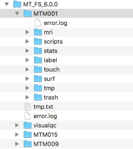
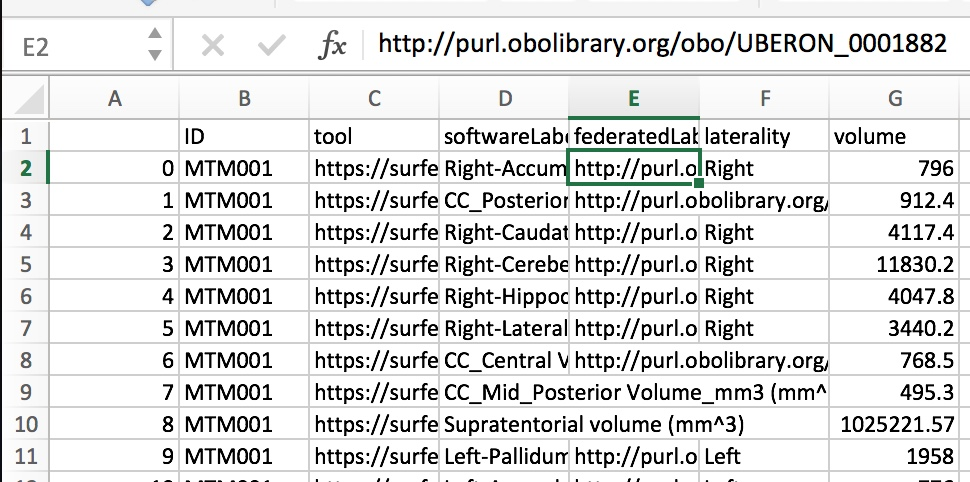
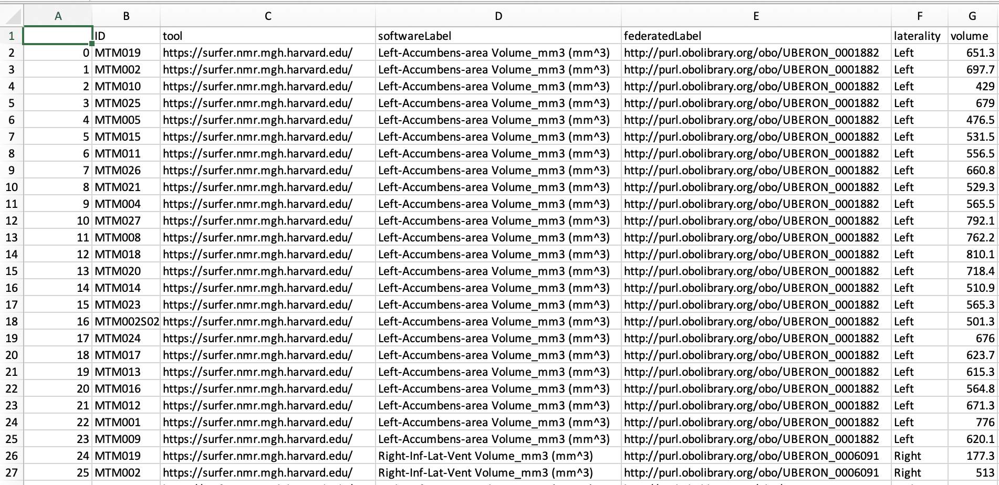
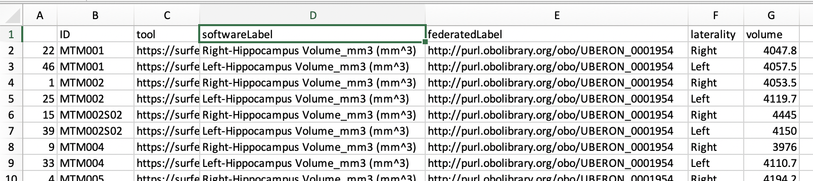
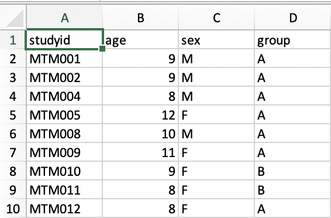
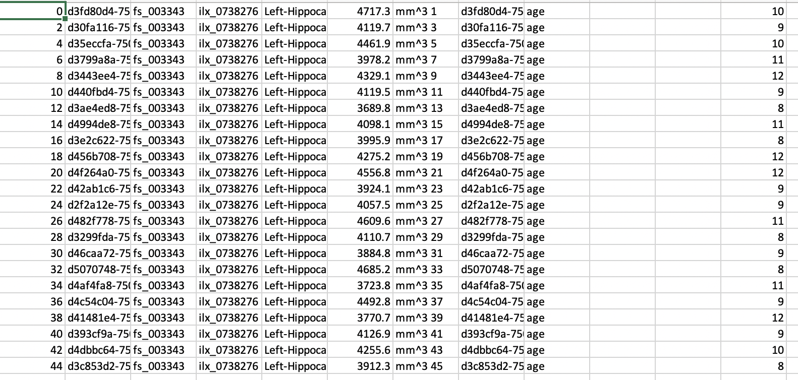
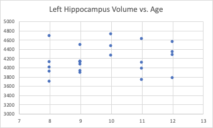
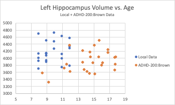
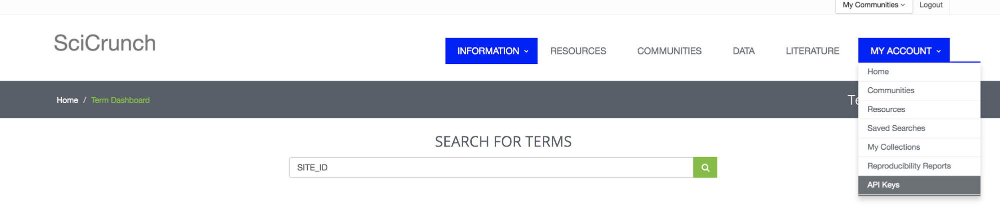

Volume 4: How Would ReproNim Manage Local FreeSurfer Results
------------------------------------------------------------

Version 1.2, Published DATE.

doi: `10.18116/tvz6-1d44 <https://dx.doi.org/doi:10.18116/tvz6-1d44>`_

**Change log**

- Version 0.9: Published April 28, 2020.
- Version 1.0: Published May 6, 2020.  Includes some text corrections and an accompanying notebook.
- Version 1.2: Published DATE.  Formatting for Sphinx.

**Summary**

This document teaches:

- How to generate semantically encoded FreeSurfer results:

    + ``segstats2nidm -add_de -s /Users/user/Data/MT/MT_FS_6.0.0/MTM001 -o /Users/user/segstats_jsonld/result``

- How to merge data sources:

    + ``pynidm merge -nl MT_demog.ttl,allMTaseg.ttl -s -o MTdemog_aseg.ttl``

- How to query data sources:

    + ``pynidm query -nl MTdemog_aseg.ttl,Brown.ttl --get_fields age,fs_003343 -o integrated_output.csv``

- What you gain from the ReproNim Way:

    + Ease of shareability with your ‘future self’ and others 
    + Ease of data integration for additional local and public data sources.

**Overview**

- :ref:`vol4_problem_statement`
- :ref:`vol4_repronim_solution`
- :ref:`vol4_costs`
- :ref:`vol4_gains`
- :ref:`vol4_conclusion`
- :ref:`vol4_appendix`

**Stakeholder**: End User (Data Analyst)

.. findoutmore:: Jupyter Notebook

   This document has an accompanying Jupyter Notebook.  `Find it
   on GitHub <https://github.com/ReproNim/how-would-repronim-4>`__
   or `run it on Binder
   <https://mybinder.org/v2/gh/ReproNim/how-would-repronim-4.git/master?filepath=how-would-repronim-4.ipynb>`__.

.. _vol4_problem_statement:

Problem Statement
^^^^^^^^^^^^^^^^^

I have performed a FreeSurfer analysis
locally. I hear that ReproNim has some cool tools to manage the
results of such an analysis. What are they and how do I do it?

In this example I’ve run FreeSurfer 6.0 on a set of 24 subjects. I have
a FreeSurfer $SUBJECTS_DIR (called MT_FS_6.0.0) that looks like the
figure at the right. Each of my subjects has an *aseg.stats* file in
their */stats* directory.

.. _vol4_repronim_solution:

ReproNim Solution
^^^^^^^^^^^^^^^^^

In theory
"""""""""

Given the FreeSurfer results, we will use the
`segstats_jsonld <https://github.com/ReproNim/segstats_jsonld>`__
program to create a NeuroImaging Data Model (NIDM) semantically marked
up version of the volumetric data files. The semantic markup makes the
FreeSurfer results ‘self describing’ in that each result is associated
with a ‘concept’ that completely describes the result (type of measure
(i.e. volume), which structure (i.e. Caudate Nucleus), etc.). Complete
semantic description of results makes integration of results from
disparate sources easier. Once we’ve created the NIDM version of the
FreeSurfer results, we can query our results, using
`PyNIDM <https://github.com/incf-nidash/PyNIDM>`__, and, more
importantly, we can merge my local results with publically available
results and query across these combined data representations.

In Practice
"""""""""""

OK, we can do this!

Pre-requisites: `conda <https://docs.conda.io/en/latest/>`__.

1. Install `segstats_jsonld <https://github.com/ReproNim/segstats_jsonld>`__

.. code-block:: bash

    $ conda create -n segstats_jsonld python=3
    $ source activate segstats_jsonld
    $ cd segstats_jsonld
    $ pip install -e .

2. Run asegstats2nidm on a single subject (MTM001) in order to express my FreeSurfer results in NIDM [1]_.

.. code-block:: bash

    $ segstats2nidm -add_de -s
    /Users/davidkennedy/Data/MT/MT_FS_6.0.0/MTM001 -o /Users/davidkennedy/segstats_jsonld/test
    Creating NIDM file...
    Writing NIDM file...
    Creating NIDM file...
    Writing NIDM file...
    Creating NIDM file...
    Writing NIDM file...

This takes the aseg.stats file for my particular subject (MTM001) and
generates the following files:

.. code-block:: bash

    $ ls test
    aseg_nidm.ttl lh.aparc_nidm.ttl rh.aparc_nidm.ttl

3. Examine a NIDM file to see what it has using ‘\ *PyNIDM query*\ ’.  PyNIDM is installed with segstats_jsonld, but, if you need to reinstall it, see this `link <https://github.com/incf-nidash/PyNIDM>`__.

.. code-block:: bash

    $ pynidm query -nl /Users/davidkennedy/segstats_jsonld/test/aseg_nidm.ttl,/Users/davidkennedy/segstats_jsonld/test/lh.aparc_nidm.ttl,/Users/davidkennedy/segstats_jsonld/test/rh.aparc_nidm.ttl -bv -o /Users/davidkennedy/my_query_results.txt

You can view this result file with:

.. code-block:: bash

    $ more /Users/davidkennedy/my_query_results.txt
    ,ID,tool,softwareLabel,federatedLabel,laterality,volume

    0,MTM001,https://surfer.nmr.mgh.harvard.edu/,Right-Accumbens-area Volume_mm3 (mm^3),http://purl.obolibrary.org/obo/UBERON_0001882,Right,796.0
    1,MTM001,https://surfer.nmr.mgh.harvard.edu/,CC_Posterior Volume_mm3 (mm^3),http://purl.obolibrary.org/obo/UBERON_0015708,,912.4
    2,MTM001,https://surfer.nmr.mgh.harvard.edu/,Right-Caudate Volume_mm3 (mm^3),http://purl.obolibrary.org/obo/UBERON_0001873,Right,4117.4
    3,MTM001,https://surfer.nmr.mgh.harvard.edu/,Right-Cerebellum-White-Matter Volume_mm3 (mm^3),\ http://purl.obolibrary.org/obo/UBERON_0002317,Right,11830.2
    ...

Or open it in your favorite viewer, such as Excel (and parse into
columns using comma separator):

4. So, that was one subject, but I have a whole FreeSurfer Subjects_dir set of (N=24) results, let’s make a NIDM representation of this complete set. It is an exercise to the reader to figure out how to accomplish this. On my MAC, I did something like the following:

.. code-block:: bash

    $ mkdir MT
    $ csh
    $ foreach f ( \`cat MT_Cases.txt\` )
    echo $f
    mkdir MT/$f
    segstats2nidm -add_de -s /Users/davidkennedy/Data/MT/MT_FS_6.0.0/{$f} -o /Users/davidkennedy/segstats_jsonld/MT/{$f}
    end
    $ exit

This results in in a folder (MT) with subfolders for each subject
(MTM001, etc.) which each contain the corresponding aseg_nidm.ttl,
lh.aparc_nidm.ttl, and rh.aparc_nidm.ttl files.

5. It is unwieldy to work with 24 separate sets of files, so we can combine the relevant .ttl files into one, for our specific purposes. For the examples to follow, we will only need the ‘aseg’ results, so we will concatenate the ‘aseg’ NIDM files from each of the subjects into one file:

.. code-block:: bash

    $ cd MT
    $ pynidm concat -nl "$(echo $(ls -1 \*/aseg_nidm.ttl) \| tr " " "," )" -o allMTaseg.ttl

6. Querying on this combined file.

We can now query this combined file for various content (remember that
all this file has is the regional volumes per subject). First, let’s
just look at the whole file for brain volumes (-bv):

.. code-block:: bash

    $ pynidm query -nl allMTaseg.ttl -bv -o my_query_results1.txt

You can ‘more’ this results file:

.. code-block:: bash

    $ more my_query_results1.txt
    ,ID,tool,softwareLabel,federatedLabel,laterality,volume
    0,MTM019,https://surfer.nmr.mgh.harvard.edu/,Left-Accumbens-area Volume_mm3 (mm^3),http://purl.obolibrary.org/obo/UBERON_0001882,Left,651.3
    1,MTM002,https://surfer.nmr.mgh.harvard.edu/,Left-Accumbens-area Volume_mm3 (mm^3),http://purl.obolibrary.org/obo/UBERON_0001882,Left,697.7
    2,MTM010,https://surfer.nmr.mgh.harvard.edu/,Left-Accumbens-area Volume_mm3 (mm^3),http://purl.obolibrary.org/obo/UBERON_0001882,Left,429.0
    ...

Or read it into, for example, Excel:

Next, we can ask for a specific brain structure (i.e. Hippocampus) by
providing the appropriate SPARQL query:

.. code-block:: bash

    $ curl https://www.nitrc.org/frs/download.php/11750/hippocampus_query.sparql > hippocampus_query.sparql # get the query
    $ pynidm query -nl allMTaseg.ttl -q hippocampus_query.sparql -o my_query_results2.txt

This results in:

.. code-block:: bash

    $ more my_query_results2.txt
    ,ID,tool,softwareLabel,federatedLabel,laterality,volume
    0,MTM019,https://surfer.nmr.mgh.harvard.edu/,Right-Hippocampus Volume_mm3 (mm^3),http://purl.obolibrary.org/obo/UBERON_0001954,Right,4053.2
    1,MTM002,https://surfer.nmr.mgh.harvard.edu/,Right-Hippocampus Volume_mm3 (mm^3),http://purl.obolibrary.org/obo/UBERON_0001954,Right,4053.5
    2,MTM010,https://surfer.nmr.mgh.harvard.edu/,Right-Hippocampus Volume_mm3 (mm^3),http://purl.obolibrary.org/obo/UBERON_0001954,Right,4237.8
    3,MTM025,https://surfer.nmr.mgh.harvard.edu/,Right-Hippocampus Volume_mm3 (mm^3),http://purl.obolibrary.org/obo/UBERON_0001954,Right,4378.0
    ...

And:

Great. So this is my local NIDM ‘pool’ of FreeSurfer data from a
particular study. This would be more useful if I can include my
demographics and other clinical/behavioral variables.

7. Adding My demographics.

For this example, I have my demographics (age (in years), sex, group) in
a .csv file (MT_demog.csv). I want to express this data in the NIDM file
containing my freesurfer data (allMTseg.ttl) so that it can be queried
and used for analysis. I have two options, I can use *csv2nidm* and
choose to add the demographics data to an existing NIDM file (shown
below) or I can run *csv2nidm* without adding to an existing NIDM file
and use \`pynidm merge -s\` later to merge NIDM files by subject ID.
*csv2nidm* interacts with a service called
`InterLex <https://scicrunch.org/scicrunch/interlex/dashboard>`__ for
management of common terms and data elements. As csv2nidm can permit the
creation of new terms (for your ongoing use, or for the future use by
others) we need to be authorized to interact with the InterLex service.
We do this by generating an InterLex API Key (see `Appendix
1 <#appendix-1-getting-an-interlex-api-key>`__).

.. code-block:: bash

    $ csv2nidm -csv ~/Downloads/MT_demog.csv -out /[K~/Downloads/MT_demog.ttl
    You will now be asked a series of questions to annotate your source variable: studyid
    Please enter a full name to associate with the variable [studyid]:
    Please enter a definition for this variable: Participant identifier
    Please enter the value type for this variable from the following list:
    1: string - The string datatype represents character strings
    2: categorical - A variable that can take on one of a limited number of possible values, assigning each to a nominal category on the basis of some qualitative property.
    3: boolean - Binary-valued logic:{true,false}
    4: integer - Integer is a number that can be written without a fractional component
    5: float - Float consists of the values m × 2^e, where m is an integer whose absolute value is less than 2^24, and e is an integer between -149 and 104, inclusive
    6: double - Double consists of the values m × 2^e, where m is an integer whose absolute value is less than 2^53, and e is an integer between -1075 and 970, inclusive
    7: duration - Duration represents a duration of time
    8: dateTime - Values with integer-valued year, month, day, hour and minute properties, a decimal-valued second property, and a boolean timezoned property.
    9: time - Time represents an instant of time that recurs every day
    10: date - Date consists of top-open intervals of exactly one day in length on the timelines of dateTime, beginning on the beginning moment of each day (in each timezone)
    11: anyURI - anyURI represents a Uniform Resource Identifier Reference (URI). An anyURI value can be absolute or relative, and may have an optional fragment identifier
    Please enter the datatype [1:11]: 1
    Please enter the minimum value [NA]:
    Please enter the maximum value [NA]:
    Please enter the units [NA]:

    ************************************************************************************
    Stored mapping Column: studyid ->
    label: studyid
    source variable: studyid
    description: Participant identifier
    valueType: http://www.w3.org/2001/XMLSchema#string
    ---------------------------------------------------------------------------------------

    Concept Association
    Query String: studyid
    1: Narrow Interlex query
    2: Change query string from: "studyid"
    3: No concept needed for this variable

    ---------------------------------------------------------------------------------------

    Please select an option (1:3) from above: 3
    You will now be asked a series of questions to annotate your source variable: age
    Please enter a full name to associate with the variable [age]:
    Please enter a definition for this variable: Age of participant at scan
    Please enter the value type for this variable from the following list:
    1: string - The string datatype represents character strings
    2: categorical - A variable that can take on one of a limited number of possible values, assigning each to a nominal category on the basis of some qualitative property.
    3: boolean - Binary-valued logic:{true,false}
    4: integer - Integer is a number that can be written without a fractional component
    5: float - Float consists of the values m × 2^e, where m is an integer whose absolute value is less than 2^24, and e is an integer between -149 and 104, inclusive
    6: double - Double consists of the values m × 2^e, where m is an integer whose absolute value is less than 2^53, and e is an integer between -1075 and 970, inclusive
    7: duration - Duration represents a duration of time
    8: dateTime - Values with integer-valued year, month, day, hour and minute properties, a decimal-valued second property, and a boolean timezoned property.
    9: time - Time represents an instant of time that recurs every day
    10: date - Date consists of top-open intervals of exactly one day in length on the timelines of dateTime, beginning on the beginning moment of each day (in each timezone)
    11: anyURI - anyURI represents a Uniform Resource Identifier Reference (URI). An anyURI value can be absolute or relative, and may have an optional fragment identifier
    Please enter the datatype [1:11]: 4
    Please enter the minimum value [NA]: 0
    Please enter the maximum value [NA]: 120
    Please enter the units [NA]: years

    ************************************************************************************
    Stored mapping Column: age ->
    label: age
    source variable: age
    description: Age of participant at scan
    valueType: http://www.w3.org/2001/XMLSchema#integer
    hasUnit: years
    maximumValue: 120
    ---------------------------------------------------------------------------------------

    Concept Association
    Query String: age
    InterLex:
    1: Label: Age Definition: A time quality inhering in a bearer by virtue of how long it has existed. Preferred URL: http://uri.interlex.org/base/ilx_0100400
    2: Label: Maternal Age Definition: The age of the mother in PREGNANCY.  Preferred URL: http://id.nlm.nih.gov/mesh/2018/M0013110
    3: Label: Marriage Age Definition: Preferred URL: http://id.nlm.nih.gov/mesh/2018/M0013057
    4: Label: Age Factors Definition: Age as a constituent element or influence contributing to the production of a result. It may be applicable to the cause or the effect of a circumstance. It is used with human or animal concepts but should be differentiated from AGING, a physiological process, and TIME FACTORS which refers only to the passage of time. Preferred URL: http://id.nlm.nih.gov/mesh/2018/M0000561
    5: Label: Decreased age Definition: An age which is relatively low.  Preferred URL: http://uri.interlex.org/base/ilx_0102881
    6: Label: Patients Age Definition: Age of the Patient. Preferred URL: http://uri.interlex.org/dicom/uris/terms/0010_1010
    7: Label: Parental Age Definition: Preferred URL: http://id.nlm.nih.gov/mesh/2018/M0015943
    8: Label: Paternal Age Definition: Age of the biological father.  Preferred URL: http://id.nlm.nih.gov/mesh/2018/M0016008
    9: Label: Age Reporting Definition: Preferred URL: http://id.nlm.nih.gov/mesh/2018/M0000562
    10: Label: Increased age Definition: An age which is relatively high.  Preferred URL: http://uri.interlex.org/base/ilx_0105323
    NIDM Terms:
    11: Label(NIDM Term): race Definition: None URL: http://semanticscience.org/resource/SIO_001015
    12: Label(NIDM Term): age Definition: None URL: http://semanticscience.org/resource/SIO_001013
    13: Label(NIDM Term): name Definition: None URL: http://semanticscience.org/resource/SIO_000116
    14: Label(NIDM Term): male Definition: A biological sex quality inhering in an individual or a population whose sex organs contain only male gametes. URL: http://purl.obolibrary.org/obo/PATO_0000384
    15: Narrow Interlex query
    16: Change query string from: "age"
    17: No concept needed for this variable

    ---------------------------------------------------------------------------------------
    Please select an option (1:17) from above: 1
    
    Concept annotation added for source variable: age
    
    **You will now be asked a series of questions to annotate your source variable:** sex
    Please enter a full name to associate with the variable [sex]:
    Please enter a definition for this variable: Biological sex of participant
    Please enter the value type for this variable from the following list:
    1: string - The string datatype represents character strings
    2: categorical - A variable that can take on one of a limited number of possible values, assigning each to a nominal category on the basis of some qualitative property.
    3: boolean - Binary-valued logic:{true,false}
    4: integer - Integer is a number that can be written without a fractional component
    5: float - Float consists of the values m × 2^e, where m is an integer whose absolute value is less than 2^24, and e is an integer between -149 and 104, inclusive
    6: double - Double consists of the values m × 2^e, where m is an integer whose absolute value is less than 2^53, and e is an integer between -1075 and 970, inclusive
    7: duration - Duration represents a duration of time
    8: dateTime - Values with integer-valued year, month, day, hour and minute properties, a decimal-valued second property, and a boolean timezoned property.
    9: time - Time represents an instant of time that recurs every day
    10: date - Date consists of top-open intervals of exactly one day in length on the timelines of dateTime, beginning on the beginning moment of each day (in each timezone)
    11: anyURI - anyURI represents a Uniform Resource Identifier Reference (URI). An anyURI value can be absolute or relative, and may have an optional fragment identifier
    Please enter the datatype [1:11]: 2
    Please enter the number of categories/labels for this term: 2
    Are there numerical values associated with your text-based categories [yes]?
    Please enter the text string label for the category 1: Male
    Please enter the value associated with label "Male": M
    Please enter the text string label for the category 2: Female
    Please enter the value associated with label "Female": F

    ************************************************************************************

    Stored mapping Column: sex ->
    label: sex
    source variable: sex
    description: Biological sex of participant
    valueType: http://www.w3.org/2001/XMLSchema#complexType

    ---------------------------------------------------------------------------------------

    Concept Association
    Query String: sex
    InterLex:
    1: Label: Sex Work Definition: The act or practice of engaging in sexual relations for money or other benefit. Preferred URL: http://id.nlm.nih.gov/mesh/2018/M0017840
    2: Label: Genotypic Sex Definition: Preferred URL: http://id.nlm.nih.gov/mesh/2018/M0446358
    3: Label: Sex Offenses Definition: Any violation of established legal or moral codes in respect to sexual behavior. Preferred URL: http://id.nlm.nih.gov/mesh/2018/M0019747
    4: Label: Sex Preselection Definition: Methods for controlling genetic SEX of offspring. Preferred URL: http://id.nlm.nih.gov/mesh/2018/M0019749
    5: Label: Unknown sex Definition: A biological sex quality inhering in an individual whose sex is unknown. Preferred URL: http://uri.interlex.org/base/ilx_0112183
    6: Label: Phenotypic sex Definition: Preferred URL: http://uri.interlex.org/base/ilx_0108810
    7: Label: Biological sex Definition: A monadic quality of continuant inhering in an organism by virtue of its being able to undergo sexual reproduction in order to differentiate the individuals or types involved. Preferred URL: http://uri.interlex.org/base/ilx_0101292
    8: Label: Sex Education Definition: Education which increases the knowledge of the functional, structural, and behavioral aspects of human reproduction. Preferred URL: http://id.nlm.nih.gov/mesh/2018/M0019741
    9: Label: Sex Ratio Definition: The number of males per 100 females.  Preferred URL: http://id.nlm.nih.gov/mesh/2018/M0019750
    10: Label: Sex Workers Definition: People who engage in occupational sexual behavior in exchange for economic rewards or other extrinsic considerations. Preferred URL: http://id.nlm.nih.gov/mesh/2018/M0553909
    11: Narrow Interlex query
    12: Change query string from: "sex"
    13: No concept needed for this variable

    ---------------------------------------------------------------------------------------

    Please select an option (1:13) from above: 12
    Please input new search string for CSV column: sex :biological sex

    ---------------------------------------------------------------------------------------

    Concept Association

    Query String: biological sex

    InterLex:
    1: Label: Biological sex Definition: A monadic quality of continuant inhering in an organism by virtue of its being able to undergo sexual reproduction in order to differentiate the individuals or types involved. Preferred URL: http://uri.interlex.org/base/ilx_0101292
    2: Label: Pigments, Biological Definition: Any normal or abnormal coloring matter in PLANTS; ANIMALS or micro-organisms. Preferred URL: http://id.nlm.nih.gov/mesh/2018/M0016854
    3: Label: Biological Aging Definition: Preferred URL: http://id.nlm.nih.gov/mesh/2018/M0000574
    4: Label: Biological rhythm Definition: Any process pertinent to the generation and maintenance of rhythms in the physiology of an organism.  Preferred URL: http://uri.neuinfo.org/nif/nifstd/nlx_122
    5: Label: Biological Monitoring Definition: The monitoring of the level of toxins, chemical pollutants, microbial contaminants, or other harmful substances in the living organisms present in an environment. Preferred URL: http://id.nlm.nih.gov/mesh/2018/M0007511
    6: Label: Biological Dressings Definition: Human or animal tissue used as temporary wound coverings. Preferred URL: http://id.nlm.nih.gov/mesh/2018/M0002526
    7: Label: Biological Stress Definition: Preferred URL: http://id.nlm.nih.gov/mesh/2018/M0520677
    8: Label: Biological Camouflage Definition: The blending in of an organism with the colors and patterns of its physical environment or surroundings, such that it becomes indistinguishable from the latter.  Preferred URL: http://id.nlm.nih.gov/mesh/2018/M000600496
    9: Label: Biological Processes Definition: Preferred URL: http://id.nlm.nih.gov/mesh/2018/M0519534
    10: Label: Extinction, Biological Definition: The ceasing of existence of a species or taxonomic groups of organisms. Preferred URL: http://id.nlm.nih.gov/mesh/2018/M0493472
    NIDM Terms:
    11: Label(NIDM Term): biological sex Definition: An organismal quality inhering in a bearer by virtue of the bearer's ability to undergo sexual reproduction in order to differentiate the individuals or types involved. URL: http://purl.obolibrary.org/obo/PATO_0000047
    12: Label(NIDM Term): biological entity Definition: None URL: http://semanticscience.org/resource/SIO_010046
    Cognitive Atlas:
    13: Label: biological motion Definition: perception of the fluid motion of a biological agent
    14: Narrow Interlex query
    15: Change query string from: "biological sex"
    16: No concept needed for this variable

    ---------------------------------------------------------------------------------------

    Please select an option (1:16) from above: 1
    Concept annotation added for source variable: sex
    You will now be asked a series of questions to annotate your source variable: group
    Please enter a full name to associate with the variable [group]:
    Please enter a definition for this variable: Group designator for study
    Please enter the value type for this variable from the following list:
    1: string - The string datatype represents character strings
    2: categorical - A variable that can take on one of a limited number of possible values, assigning each to a nominal category on the basis of some qualitative property.
    3: boolean - Binary-valued logic:{true,false}
    4: integer - Integer is a number that can be written without a fractional component
    5: float - Float consists of the values m × 2^e, where m is an integer whose absolute value is less than 2^24, and e is an integer between -149 and 104, inclusive
    6: double - Double consists of the values m × 2^e, where m is an integer whose absolute value is less than 2^53, and e is an integer between -1075 and 970, inclusive
    7: duration - Duration represents a duration of time
    8: dateTime - Values with integer-valued year, month, day, hour and minute properties, a decimal-valued second property, and a boolean timezoned property.
    9: time - Time represents an instant of time that recurs every day
    10: date - Date consists of top-open intervals of exactly one day in length on the timelines of dateTime, beginning on the beginning moment of each day (in each timezone)
    11: anyURI - anyURI represents a Uniform Resource Identifier Reference (URI). An anyURI value can be absolute or relative, and may have an optional fragment identifier
    Please enter the datatype [1:11]: 2
    Please enter the number of categories/labels for this term: 2
    Are there numerical values associated with your text-based categories
    [yes]? no
    Please enter the text string label for the category 1: A
    Please enter the text string label for the category 2: B

    ************************************************************************************

    Stored mapping Column: group ->
    label: group
    source variable: group
    description: Group designator for study
    valueType: http://www.w3.org/2001/XMLSchema#complexType

    ---------------------------------------------------------------------------------------

    Concept Association

    Query String: group

    InterLex:
    1: Label: Group Definition: Collection of individuals interested in or working towards a common purpose, e.g., working group, special interest group Preferred URL: http://uri.neuinfo.org/nif/nifstd/nlx_152625
    2: Label: Participant Group Definition: The group a participant belongs to for a given project. Preferred URL: http://uri.neuinfo.org/nif/nifstd/nlx_151449
    3: Label: Group Number Definition: The first number in the ordered pair of numbers that makes up a Data Element Tag. Preferred URL: http://uri.interlex.org/dicom/uris/terms/0000_0042
    4: Label: Repeating Group Definition: Standard Data Elements within a particular range of Group Numbers where elements that have identical Element Numbers have the same meaning within each Group (and the same VR, VM, and Data Element Type). Repeating Groups shall only exist for Curves and Overlay Planes (Group Numbers (50xx,eeee) and (60xx,eeee), respectively) and are a remnant of versions of this standard prior to V3.0. Preferred URL: http://uri.interlex.org/dicom/uris/terms/0000_0051
    5: Label: Group Homes Definition: Housing for groups of patients, children, or others who need or desire emotional or physical support.  They are usually established as planned, single housekeeping units in residential dwellings that provide care and supervision for small groups of residents, who, although unrelated, live together as a family.  Preferred URL: http://id.nlm.nih.gov/mesh/2018/M0024993
    6: Label: methylsulfonylethyloxycarbonyl group Definition: Preferred URL: http://id.nlm.nih.gov/mesh/2018/M0057496
    7: Label: Cell group Definition: A group of cells that may not be contained within macroscopic anatomical boundaries, e.g., A9 dopaminergic cell group; massa intercalata of the amygdala Preferred URL: http://purl.obolibrary.org/obo/UBERON_0014778
    8: Label: Group Processes Definition: The procedures through which a group approaches, attacks, and solves a common problem. Preferred URL: http://id.nlm.nih.gov/mesh/2018/M0009650
    9: Label: Peer Group Definition: Group composed of associates of same species, approximately the same age, and usually of similar rank or social status. Preferred URL: http://id.nlm.nih.gov/mesh/2018/M0016095
    10: Label: Ethnic Group Definition: Ethnic group or race of patient.  Preferred URL: http://uri.interlex.org/dicom/uris/terms/0010_2160
    NIDM Terms:
    11: Label(NIDM Term): Group Definition: A group is a collection of subjects or objects formed by the assignment of membership through the selection of one or more common characteristics. URL: http://purl.org/nidash/nidm#Group
    12: Label(NIDM Term): control group Definition: None URL: http://semanticscience.org/resource/SIO_001068
    13: Narrow Interlex query
    14: Change query string from: "group"
    15: No concept needed for this variable

    ---------------------------------------------------------------------------------------

    Please select an option (1:15) from above: 11
    Concept annotation added for source variable: group
    Creating NIDM file...
    1: studyid
    2: age
    3: sex
    4: group
    Please select the subject ID field from the list above: 1
    Writing NIDM file....

8. At this point you have two separate NIDM files, one with demographics data and one with freesurfer data. Let’s merge both together by the subject identifiers. Now MTdemog_aseg.ttl has both your demographics data and freesurfer brain volumes

.. code-block:: bash

    $ pynidm merge -nl MT_demog.ttl,allMTaseg.ttl -s -o MTdemog_aseg.ttl

9. Querying for age and Left Hippocampus volume.

Now that we’ve merged our demographics data with our existing FreeSurfer NIDM file we can now query this combined file with a query (using the API query form for ‘\ *pynidm query’*) that will return the hippocampus volumes and include the subject age:

(a) First we need to query for the project identifier in the NIDM file

.. code-block:: bash

    $ pynidm query -nl MTdemog_aseg.ttl -u /projects
    UUID
    ------------------------------------
    C1123358-7f6c-11ea-96e1-c82a141f5fe7

(b) Next let’s find out what we have available for Hippocampus statistics

.. code-block:: bash

    $ pynidm query -nl MTdemog_aseg.ttl -u /projects/c1123358-7f6c-11ea-96e1-c82a141f5fe7 \| grep "Hippo"
    fs_003342 Left-Hippocampus NVoxels
    fs_003343 Left-Hippocampus Volume_mm3 (mm^3)
    fs_003347 Left-Hippocampus normMax (MR)
    fs_003344 Left-Hippocampus normMean (MR)
    fs_003346 Left-Hippocampus normMin (MR)
    fs_003348 Left-Hippocampus normRange (MR)
    fs_003345 Left-Hippocampus normStdDev (MR)
    fs_003447 Right-Hippocampus NVoxels
    fs_003448 Right-Hippocampus Volume_mm3 (mm^3)
    fs_003452 Right-Hippocampus normMax (MR)
    fs_003449 Right-Hippocampus normMean (MR)
    fs_003451 Right-Hippocampus normMin (MR)
    fs_003453 Right-Hippocampus normRange (MR)
    fs_003450 Right-Hippocampus normStdDev (MR)

(c) Ok so of the results above I’m interested in left hippocampus volume which has id “fs_003343”. Next let’s see if we have “age” in the dataset

.. code-block:: bash

    $ pynidm query -nl MTdemog_aseg.ttl -u /projects/c1123358-7f6c-11ea-96e1-c82a141f5fe7 \| grep "age”
    ImageContrastType []
    ImageUsageType []
    age_e3hrcc age

(d) Ok, looks like we have a variable for age. Now let’s query the NIDM file and ask for only these 3 fields of interest (notice the ?fields= part of the query) and save them to an output file for data analysis

.. code-block:: bash

    $ pynidm query -nl MTdemog_aseg.ttl -u /projects/c1123358-7f6c-11ea-96e1-c82a141f5fe7?fields=age,fs_003343 -o MT_age_hippovol.csv
    $ tail -n +2 MT_age_hippovol.csv \| paste -d " " - - > MT_age_hippovol2.csv

View this result (excel)

Plot this result:

10. Adding public data.

So since I can name multiple NIDM files to be the target of my query,
and can combine multiple of my own local studies, or access other
publicly available sources of data. Let's grab the publically
accessible version of the FreeSurfer analysis of one of the ADHD-200
data set sites:

.. code-block:: bash

    $ curl https://raw.githubusercontent.com/dbkeator/simple2_NIDM_examples/master/datasets.datalad.org/adhd200/RawDataBIDS/Brown/nidm.ttl > Brown.ttl

Query your data and ABIDE data. For this you can either do an integrated
query writing a SPARQL query or you can do it in 2 steps using the
pynidm query functions. Using our previous method in step (7) and
applying it to the set of files using some simple bash scripting:

.. code-block:: bash

    $ pynidm query -nl MTdemog_aseg.ttl,Brown.ttl --get_fields age,fs_003343 -o integrated_query_long.csv ; tail -n +2 integrated_query_long.csv \| paste -d " " - - >> integrated_query.csv ; rm integrated_query_long.csv

Ok let’s unpack the command above. First we’re using pynidm query to get
specific fields (i.e. age, fs_003343) from our nidm files and saving
those to a csv output file that is in long format. Then we’re using
command line tools \`tail\` and \`paste\` to reorganize the file to a
wide format for easy graphing and finally removing the temporary long
format file.

We can now plot Left Hippocampus Volume and age, comparing and
contrasting between my two sources; my local data and the ADHD:200 Brown
site.

Voila! Your data and public data together.

.. _vol4_costs:

What did this cost me?
^^^^^^^^^^^^^^^^^^^^^^

The ReproNim way, in this case, has ‘cost you’ some extra steps. After
running FreeSurfer as you normally would, we have you express these
results also in NIDM. Not too painful, and someday, FreeSurfer may have
the option to do this itself. Merging the multiple FreeSurfer nidm
results is conceptually equivalent to the *FreeSurfer* *asegstats2table*
command, but resulting in a NIDM representation of this ‘table’. The
NIDMification of your local demographics file can be a little time
consuming (which is why ReproNim recommends performing the markup of
your demographics file when you set it up). But, while verbose, the
*csv2nidm* markup performs the semantic markup that you need to do
somehow, eventually, for your own ‘future self’ and ‘others’ who may
want to understand your data without pestering you over and over again.
So, is something you have to do anyway really a cost?

.. _vol4_gains:

What have I gained?
^^^^^^^^^^^^^^^^^^^

The querying of the data in its NIDM form does ‘cost’ you a new tool,
and indeed, to start, can be more laborious than handling the local
results in csv (in Excel or Python or R, etc., which you will still have
to do for your statistical treatment of the data). But this form of the
data makes the integration of multiple data sources more
straightforward. Data from multiple of your own or others projects can
be merged and integrated more easily, and commonalities of measurement
be identified.

.. _vol4_conclusion:

Conclusion
^^^^^^^^^^

Great! You’ve made it to the end of this example. You now know how to
turn your own existing trove of FreeSurfer data into a FAIR
representation (emphasizing the Accessibility of this data to you and
others, the Interoperability and the Reusability of this data in this
representation). From this basic knowledge you should be able to
customize this approach to the more practical example from your real
life with other local tools and other remote data sources. To do this in
practice, it would be great if you learn about the following tools:

-  segstats_jsonld:
      `GitHub <https://github.com/ReproNim/segstats_jsonld>`__

-  PyNIDM: `GitHub <https://github.com/incf-nidash/PyNIDM>`__

To learn more, see the ReproNim `Website <http://repronim.org>`__, or
contact info@repronim.org.

.. _vol4_appendix:

Appendix
^^^^^^^^

Getting an InterLex API key
"""""""""""""""""""""""""""

We get this by doing the following:

   Go to: https://scicrunch.org/scicrunch/interlex/dashboard

i.  Click ’login’ in upper right corner

    1. If you do not have an InterLex account, click ‘Register’...

ii. Once logged in click “MyAccount” -> API Keys

iii. Re-authorize; click generate_an_API button

iv.  Copy your newly created key and add it as an environment variable
        in your system called INTERLEX_API_KEY to use in the next steps

.. [1]
   In the command that follows, please note that: Paths must be
   absolute; Output directory must exist.
