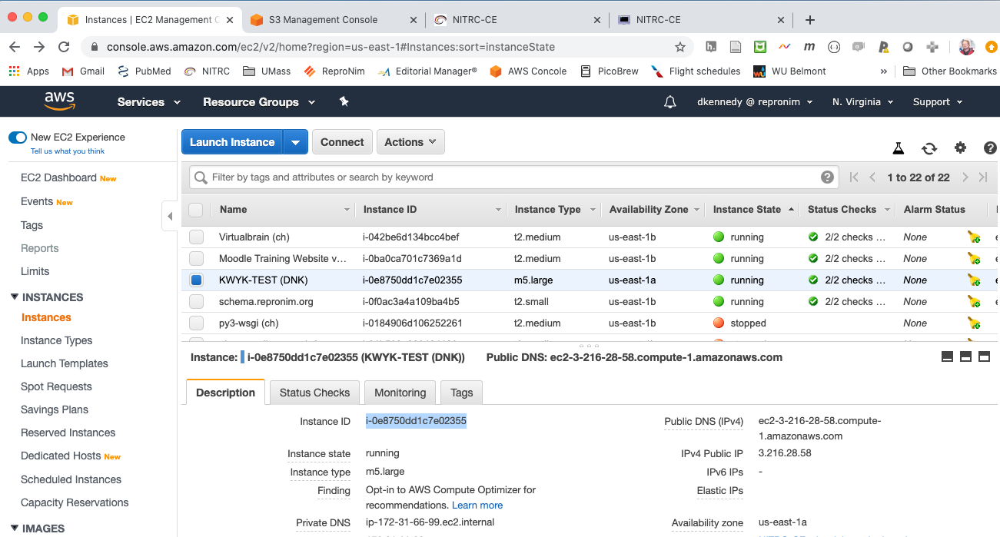
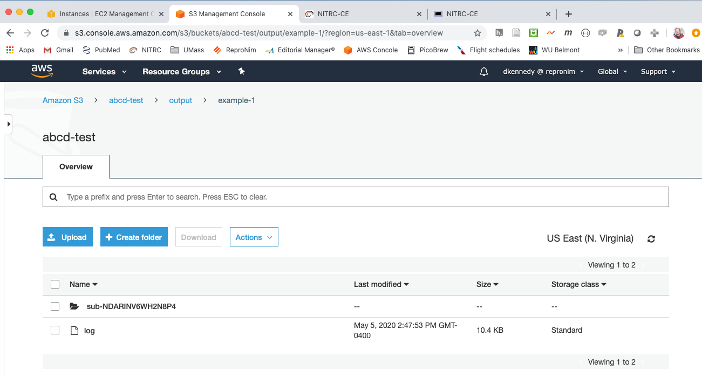
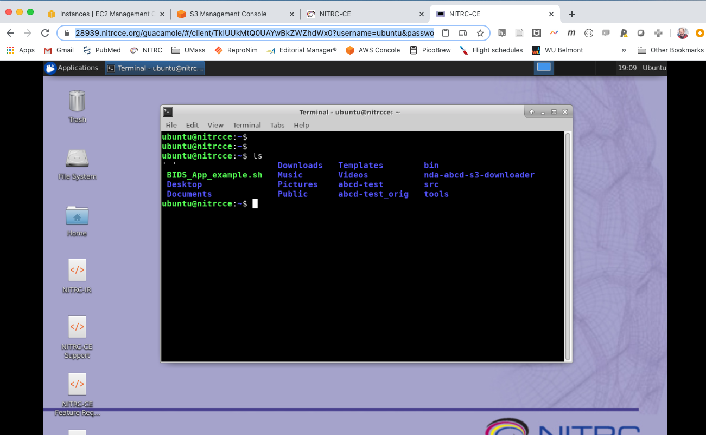

.. _vol-6:

Volume 6: How Would ReproNim do an ABCD Analysis
------------------------------------------------

Version 0.91, published September 3, 2020.

**Change log**

- Version 0.9: published May 6, 2020.
- Version 0.91: published September 3, 2020.  Formatting for Sphinx.

**Overview**

- :ref:`vol6_problem_statement`
- :ref:`vol6_repronim_solution`

**Stakeholder**: End User (Data Analyst)

.. _vol6_problem_statement:

Problem Statement
^^^^^^^^^^^^^^^^^

Here’s a simple ‘real world’ problem. I have access to ABCD data, and
would like to run a containerized analysis on that imaging data. More
specifically, let’s say that the container I’d like to run is
dcanlabs/abcd-hcp-pipeline:latest
(`GitHub <https://github.com/DCAN-Labs/abcd-hcp-pipeline>`__,
`DockerHub <https://hub.docker.com/r/dcanlabs/abcd-hcp-pipeline>`__), a
“BIDS application for processing functional MRI data, robust to scanner,
acquisition and age variability”. **NOTE:** While the problem statement
is ‘simple’, this is a rather complex exercise due to the requirement to
manage protected access to ABCD.

.. _vol6_repronim_solution:

ReproNim Solution
^^^^^^^^^^^^^^^^^

In theory
"""""""""

ABCD data is hosted in the cloud (AWS S3), thus imaging processing
should be considered to also occur in the cloud (AWS EC2). We looked at
a ‘simple’ local ‘container-run’ processing in the “How Would ReproNim:
Do Local Container Analysis” (Volume 1)
`document <https://docs.google.com/document/d/1L4ODHVp36NilWQRi3gDYQK_N58ZXpMKqHagv0ZmtkbA/edit>`__.
In this case, we will want to extend this to operating at an AWS EC2
computational resource. The steps include 1) moving the relevant data
from the S3 storage site onto your EC2 instance; 2) running the
container on your EC2 instance, and 3) copying the results off your EC2
instance.

In Practice: The Gory Details
"""""""""""""""""""""""""""""

OK, let’s do this!

The CloudComputeExample project at
`GitHub <https://github.com/dnkennedy/CloudComputeExample>`__ provides
examples of this use case.

First, a little background and terminology I’m using:

I have a ‘$project’, in this case called “abcd-test”. I will have a
script that runs on the EC2 instance, called “$project_aws.sh” (i.e.
*abcd-test_aws.sh*) and a script that orchestrates the overall procedure
from my local computer, called “$project_local.sh” (i.e.
*abcd-test_local.sh*).

The steps include:

1) Establish the AWS EC2 platform

   a. Instance type(s)
   b. Install necessary software
   c. AWS Script ($project_aws.sh)

2) Establish the local controller

   a. Local Script ($project_local.sh)

1.a&b: EC2 Instance & software
^^^^^^^^^^^^^^^^^^^^^^^^^^^^^^

This example requires minimal computational horsepower, as the task in
this proof of concept to show the mechanics of the process, and not get
drowned in the analytic demands (yet!). In this example, we have
selected a m5.large instance (2 vCPUs, 8GB RAM, $0.096 per Hour). We
selected the NITRC-CE-Lite base AMI, which come preconfigured with
Docker (and Singularity) and a number of other NITRC desktop support
functions preinstalled. To this we added the *nda-abcd-s3-downloader*
(from `GitHub <https://github.com/DCAN-Labs/nda-abcd-s3-downloader>`__).

My AWS instance is “i-0e8750dd1c7e02355”.

If you are creating a new instance, you need to enable the
`EnablesEC2ToAccessSystemsManagerRole <https://console.aws.amazon.com/iam/home?region=us-east-1#roles/EnablesEC2ToAccessSystemsManagerRole>`__
in order to have this instance be permitted to receive remote execution
commands.

1.c: Script to run on the EC2 Instance
^^^^^^^^^^^^^^^^^^^^^^^^^^^^^^^^^^^^^^

`Here <https://github.com/dnkennedy/CloudComputeExample/blob/master/abcd-test_aws.sh>`__
(abcd-test_aws.sh) is the script that will be uploaded to the EC2
instance to control the EC2 instance operations.

This script has to manage A) getting the data it needs; B) running the
container it wants on that data; and C) putting the results somewhere.

A) In this case, the data it wants is being controlled by the details of
   *nda-abcd-s3-downloader*, which is configured by:

-  **datastructure_manifest.txt** - in this example, I procured my
   manifest using the instructions at *nda-abcd-s3-downloader*. As
   this EC2 instance is securely mine, I have chosen to put it (leave
   it) in the ~ubuntu/abcd-test directory on this instance. More
   generally, this file could be passed up to the EC2 from the local
   controller, if it can’t be left permanently there.

-  **subsets.txt** - names which subtypes of data should be included in
   to be pulled for each subject. In my example, I am just fetching:

   -  inputs.anat.T1w

   -  inputs.func.task-rest.

-  **subj.txt** - names which subjects to upload. In my example, I am
   just getting:

   -  sub-NDARINV6WH2N8P4

We setup these data specification files locally, and they get pushed to
the EC2 instance as part of the local controller script, so that they
are present and available for the AWS control script.

Thus, the script runs:

.. code-block:: bash

    # Fetch Case
    echo "ABCD Fetching BIDS"
    python3 ~ubuntu/nda-abcd-s3-downloader/download.py -o ~ubuntu/BIDS \
        -s ~ubuntu/$localdir/subj.txt \
        -i ~ubuntu/$localdir/datastructure_manifest.txt \
        -l ~ubuntu/nda-abcd-s3-downloader/log/ \
        -d ~ubuntu/$localdir/subsets.txt

Where $localdir has been named above in the script to be “abcd-test”.
This fetched the data into ~ubuntu/BIDS.

B) The container we want to run in this case is a simple
   “--print-commands-only” run of the dcanlabs/abcd-hcp-pipeline
   container.

This is invoked as:

.. code-block:: bash

    # Run Container
    docker run --rm -v /home/ubuntu/BIDS:/bids_input:ro \
        -v /home/ubuntu/DCAN:/output -v /home/ubuntu/$localdir/license.txt:/license \
        dcanlabs/abcd-hcp-pipeline /bids_input /output \
        --freesurfer-license=/license --print-commands-only >>\
        /home/ubuntu/DCAN/log

**Note:** The FreeSurfer license file is also held locally, and pushed
up to the instance by the local controller in the local setup phase. The
output directory is specified as ``/home/ubuntu/DCAN``, and the standard out
is directed to ``/home/ubuntu/DCAN/log``.

C) We export the results to an AWS S3 bucket. This script assumes we
   have a S3 bucket called abcd-test/output, and then adds the generated
   results to a sub-folder thereof named $basename, a name that is
   passed into the aws script.

.. code-block:: bash

    # Transfer data out
    echo "Copying result to s3://abcd_test/output/$basename"
    aws s3 cp ~ubuntu/DCAN s3://${bucket}/$basename --recursive --profile reprodnk

Upon this completion, the script executing on the EC2 would ask the
instance to ‘shutdown’ so as to incur no further charges once the
process has completed and the result exported. In this current example,
I’m not shutting down, but rather remembering to do this manually, to
help with debugging and make the demo run more quickly.

2. Local Control Script
^^^^^^^^^^^^^^^^^^^^^^^

`Here <https://github.com/dnkennedy/CloudComputeExample/blob/master/abcd-test_local.sh>`__
(abcd-test_local.sh) is the script that is run on your local computer to
manage the overall process. It A) takes your AWS EC2 Instance identifier
and gets it started (i.e. starts it if it’s not started…); B) gets the
IP of the instance, C) pushes up the script to run on the EC2 and all
the needed support files, and D) launches the AWS script on the EC2. The
local script takes as inputs the part to a local folder where my
*nda-abcd-s3-downloader* control files are and a *$basename* for the
resulting directory where the results will go, in this case assumed to
be a subfolder of the S3 bucket “\ *abcd-test/output*\ ”.

A) Start EC2

.. code-block:: bash

    # Start Instance
    echo "Launching and waiting"
    echo "IID = $IID"
    aws ec2 start-instances --instance-ids $IID --profile reprodnk
    aws ec2 wait instance-status-ok --instance-ids $IID --profile reprodnk

B) Get Instance IP address

.. code-block:: bash

    # Get ip, $IP and instanceID
    echo "Get ip of instance"
    IP=`aws ec2 describe-instances --instance-ids $IID --query 'Reservations[*].Instances[*].PublicIpAddress' --output text --profile reprodnk\`
    echo "Found IP as $IP"

C) Push needed files

.. code-block:: bash

    # Push stuff to instance
    # Assuming (for now) remote dir exists and contains manifest
    # make sure to include this requirement in the instructions

    echo "Pushing stuff"

    # Creds

    scp -o StrictHostKeyChecking=no -i ~/DNK_CRNC.pem ~/.aws/credentials ubuntu@${IP}:~/.aws/.

    # script 

    scp -p -i ~/DNK_CRNC.pem ${localscriptpath}/$remotescript ubuntu@${IP}:${remdir}/.

    # Manifest file (assuming it's there for now, during EC2 setup, but should check)

    #scp -i ~/DNK_CRNC.pem ${sourcedir}/datastructure_manifest.txt ubuntu@${IP}:${remdir}/.

    # Subjects

    scp -i ~/DNK_CRNC.pem ${sourcedir}/subj.txt ubuntu@${IP}:${remdir}/.

    # Subsets

    scp -i ~/DNK_CRNC.pem ${sourcedir}/subsets.txt ubuntu@${IP}:${remdir}/.

    # FS License

    scp -i ~/DNK_CRNC.pem ${sourcedir}/license.txt ubuntu@${IP}:${remdir}/.

D) Launch the script on EC2

.. code-block:: bash

    # Launch process on instance
    echo "commands=${remdir}/$remotescript $basename"
    aws ssm send-command --document-name "AWS-RunShellScript" --document-version "1" \
    --instance-ids "$IID" --parameters "commands=$remdir/$remotescript $basename" \
    --timeout-seconds "600" --max-concurrency "50" --max-errors "0" \
    --output-s3-bucket-name "abcd-test" --region us-east-1 --profile reprodnk

Example
^^^^^^^

1) Browser open to EC2 (https://console.aws.amazon.com/ec2/v2/home?region=us-east-1#Instances:sort=instanceState)

2) Browser open to S3 (https://s3.console.aws.amazon.com/s3/buckets/abcd-test/output/?region=us-east-1&tab=overview)

3) Desktop: (https://28939.nitrcce.org/guacamole/#/client/TklUUkMtQ0UAYwBkZWZhdWx0?username=ubuntu&password=i-0e8750dd1c7e02355)

4) Locally run:

.. code-block:: bash

    CloudComputeExample davidkennedy$ ./abcd-test_local.sh ~/abcd-test example-1

The instance in EC2 console:

The resulting output in S3 viewer:

Log file generated:

.. code-block:: bash

    running PreFreeSurfer
    /opt/pipeline/PreFreeSurfer/PreFreeSurferPipeline.sh \
        --path=/output/sub-NDARINV6WH2N8P4/ses-baselineYear1Arm1/files \
        --subject=NDARINV6WH2N8P4 \
        --t1=/bids_input/sub-NDARINV6WH2N8P4/ses-baselineYear1Arm1/anat/sub-NDARINV6WH2N8P4_ses-baselineYear1Arm1_rec-normalized_T1w.nii.gz \
        --t2= \
        --t1template=/opt/pipeline/global/templates/MNI152_T1_1mm.nii.gz \
        --t1templatebrain=/opt/pipeline/global/templates/MNI152_T1_1mm_brain.nii.gz \
        --t1template2mm=/opt/pipeline/global/templates/MNI152_T1_2mm.nii.gz \
        --t2template=/opt/pipeline/global/templates/MNI152_T2_1mm.nii.gz \
        --t2templatebrain=/opt/pipeline/global/templates/MNI152_T2_1mm_brain.nii.gz \
        --t2template2mm=/opt/pipeline/global/templates/MNI152_T2_2mm.nii.gz \
        --templatemask=/opt/pipeline/global/templates/MNI152_T1_1mm_brain_mask.nii.gz \
        --template2mmmask=/opt/pipeline/global/templates/MNI152_T1_2mm_brain_mask_dil.nii.gz \
        --brainsize=150 \
        --fnirtconfig=/opt/pipeline/global/config/T1_2_MNI152_2mm.cnf \
        --fmapmag=NONE \
        --fmapphase=NONE \
        --fmapgeneralelectric=NONE \
        --echodiff=NONE \
        --SEPhaseNeg=NONE \
        --SEPhasePos=NONE \
        --echospacing=NONE \
        --seunwarpdir=NONE \
        --t1samplespacing=0.000008138 \
        ...

The running EC2 instance in VNC:

