Volume 9: How Would ReproNim Containerize a Workflow
----------------------------------------------------

Version 0.7, published August 27, 2020.

**Change log**

- Version 0.5: Published April 5, 2020.
- Version 0.6: Published May 25, 2020.
- Version 0.7: Published August 27, 2020.  Formatting for Sphinx.

**Authors:** Peer Herholz and The ReproNim Team [1]_

**Special Thanks to:** Fabrizio Pizzagalli, Neda Jahanshad and Paul Thompson at ENIGMA.

**Overview**

- :ref:`vol9_problem_statement`
- :ref:`vol9_repronim_solution`
- :ref:`vol9_costs`
- :ref:`vol9_gains`
- :ref:`vol9_conclusion`

**Stakeholder**: Data Analyst

.. _vol9_problem_statement:

Problem Statement
^^^^^^^^^^^^^^^^^

Imagine you are part of a tremendously large research project that has
collaborators all over the world and you are responsible for creating
comprehensive neuroimaging data analysis workflows.More specifically,
the research project focuses on mental health, has thousands of
participants and you are tasked to create a pipeline that computes and
extracts anatomical brain shape features from MRI brain data in volume
and surface format generated by the FreeSurfer [2]_ structural analysis
pipeline. A good real-world example of such an endeavor is the Enhancing
NeuroImaging Genetics through MetaData (ENIGMA) project [3]_. After a
very long development time (several months or even years), your pipeline
(in this case /home/frodo/work/enigma/shape_features_pipeline)is working
robustly and ready to be shared with hundreds of collaborators all
around the world. Not long after you shared your script via Email, you
receive hundreds, yes hundreds, of responses, all stating that your
pipeline isn’t working and won’t even start running. What is happening?
It worked perfectly fine for you, hence they must have all been doing it
wrong… But then it hits you: nothing is wrong, everything works for you,
however, only you. In this case “you” refers to your computing
environment, the resources and setup you used all this time to create
your pipeline. It was never tested somewhere else. Maybe you are not
aware of it, but prior research work (insert references here) showed
that everything from the base, the operating system, to the top,
specific versions of libraries, and everything in between can and will
have an influence on your results. This encompasses everything from
different numbers at the 10th decimal place to changes with regard to
significance of your hypotheses. What now? Is it like the end of the
Lord of the rings:

   “How do you pick up the threads of an old life? How do you go on,
   when in your heart you begin to understand... there is no going back?
   There are some things that time cannot mend. Some hurts that go too
   deep, that have taken hold.”?

Behold, all is not lost, ReproNim to the rescue!

.. _vol9_repronim_solution:

ReproNim Solution
^^^^^^^^^^^^^^^^^

In theory
"""""""""

Ideally, going full ReproNim, every you do is under version control,
FAIR and reproducible: from data, through analysis workflows to results.
At this point in time, we have all the resources to make this a reality
and standard. Instead of only working on your machine, your analysis
pipeline can be made fully reproducible everywhere by utilizing
container technologies such as Docker or Singularity. Instead of
everything breaking down after changes, these containers and the
workflow can be placed under version control through DataLad [4]_ and
git [5]_. The former allows you to put your data under version control
to prevent the following situation(s): “What happened to my data? What
did you do with the data? Why are 20 participants missing?” and many
more. Last but not least, these tools leverage repositories, so that
everyone can find and reuse your resource without having to ask you for
it and you handling hundreds of emails in case of updates and/or
changes. Depending on your level of experience and training this all
might sound like rocket science and fairytales to you. However, it’s all
real and all possible to understand and implement yourself. ReproNim is
here to guide you along this exciting journey that will save you and
countless other folks an immense amount of time and stress.

In Practice: The Gory Details
"""""""""""""""""""""""""""""

Enough talking! Pitter patter, let’s do this! To start from the
beginning we prepare a few things. What we, that is you, need is the
following: git, a GitHub or GitLab account, Docker or Singularity and
DataLad (provide links for all). Please note: for this guide, we’re
assuming you are using GitHub and Docker. The other resources work
comparably, but may differ in small aspects and can be the topics of
future chapters of this document. On a related note: these tools work
best/natively under Unix based systems such as Linux distributions and
macOS. Windows users should consider using the Ubuntu subsystem
(reference).

**Step 1:** Create a project directory and place it under version control. 
^^^^^^^^^^^^^^^^^^^^^^^^^^^^^^^^^^^^^^^^^^^^^^^^^^^^^^^^^^^^^^^^^^^^^^^^^^

We start with creating a project directory (we will call it
*enigma_shape*), that will be placed under version control and within
which we will work on the pipeline and containers.

We create the project directory:

.. code-block:: bash

    $ mkdir /home/frodo/enigma_shape

go into it:

.. code-block:: bash

    $ cd /home/frodo/enigma_shape

and initiate version control:

.. code-block:: bash

    $ git init

As a result a hidden file called .git will be created in our project
directory (/home/frodo/enigma_shape/.git). Great, with that we have
already completed one of the most crucial steps: providing the
possibility to track and log every single change we make to whatever
being placed in our project directory. As a first and very common step,
we can create a README file that explains the content and goal of our
project, among other potentially useful and important information. Using
your favorite text editor (*nano* in the example), create the README
file. In this example, the first line creates a file called “README.md”,
the second depicts the text we want to include and the third/fourth
closes and saves our newly created file:

.. code-block:: bash

    $ nano README.md

    This is the project of the ENIGMA anatomical brain shape feature
    pipeline.

    crtl + x

    y

Now we have to add this file to our version control:

.. code-block:: bash

    $ git add README.md

While we are at it, we will move the scripts we have worked on to this
directory as our goal was to place these files under version control for
further development:

.. code-block:: bash

    $ mv /home/frodo/work/enigma/shape_features_pipeline /home/frodo/enigma_shape
    $ git add shape_features_pipeline

This is our new beginning, our new year zero. Everything we will do to
the analysis pipeline from this point in time onwards can and will be
version controlled. This includes adding the README.md and our scripts
to the “new” project. In version control terms, we ‘commit these
changes’. While doing so, we make sure to include a helpful and
informative commit message that tells us (and our future selves) what we
have changed:

.. code-block:: bash

    $ git commit -m “Add README.md and current version of scripts.”

To make everything FAIR, speed up the development process and create the
opportunity for interaction and collaboration, we will make our project
available on GitHub. To do so, we have to create a respective project on
GitHub first:

1. Login to your GitHub account

2. Click on “New repository” and name it “enigma_shape”

3. Click on “Create new repository”

With that, we have both the parts we need to make this collaborative:
our local repository where we will work on, test and implement changes
and our remote place on GitHub where we will “push” our changes to.

.. code-block:: bash

    $ git remote add origin git@github.com:frodo/enigma_shape
    $ git push -u origin master

Shortly after, our project and the included files, along with the
changes we committed can be found on GitHub, either visible for everyone
(ideal case) or only your collaborators. In either case, folks can go to
your repository and download the resources without you having to send
everything per email. Once downloaded, they can also run the analyses.
Oh, wait...wasn’t there something? Yes, there was. Namely, the whole
reason you are reading this: they most likely still cannot run it, as
the pipeline only works for you and your machine/setup. We also have to
provide the corresponding necessary *computing environment*. But how can
we do that? Buying hundreds of laptops on which we put clones of your
machine? Maybe yes, maybe no, maybe we will see how in *Step 2:
Isolating and sharing computing environments.*

**Step 2:** Isolating and sharing computing environments.
^^^^^^^^^^^^^^^^^^^^^^^^^^^^^^^^^^^^^^^^^^^^^^^^^^^^^^^^^

To answer the question (hundreds of laptops?) from before: hard no.
Ain’t nobody got money and time for that (also think about the
environment). Instead we are going to utilize *virtualization
techniques* (reference?) that allow us to create, modify and share
entire computing environments. As crazy as this might sound, it is
actually a commonly and widely used procedure these days, with a lot of
software and tools depending on it. While there are different ways to
achieve the goal of virtualization, we will go with so-called
“containers” given their efficiency, lightweight setup and supporting
resources (including online repositories). As you can see below in
**Figure 1**, the reason why they are so convenient and efficient is
because, unlike other virtualization methods, they do not simulate an
entire guest operating system with the respective resources, but utilize
the resources (CPU, RAM, etc.) of the machine on which they are running
on through the “container engine”. On top of that are the binaries and
libraries, as well as specific applications.

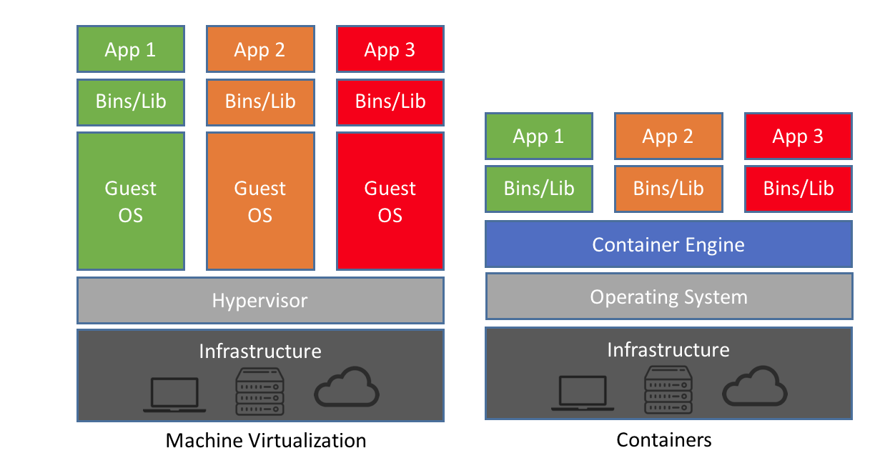

https://blog.netapp.com/wp-content/uploads/2016/03/Screen-Shot-2018-03-20-at-9.24.09-AM.png

As mentioned before there are Docker and Singularity. Both are highly
comparable in terms of usage and implementation. However, as Docker
easily escalates root privileges it is not suited for HPCs and similar
architectures. For these cases Singularity, where the user is identical
within and outside the container is more appropriate. Within our
adventure, we will use Docker, but include a section on Singularity in
the end.

So, back to our goal: isolating and sharing computing environments.
Based on the (super) short primer above, this becomes a bit more
understandable. In brief: we have to recreate the computing environment
that was used to develop and test the pipeline. Depending on your
“IT/Computer” knowledge level, this is more or less straightforward. The
process of creating containers is actually helpful in understanding the
necessary steps: containers are created or “build” based on different
“layers” which are specific components of your computing environment.
These aspects are indicated within so-called Dockerfiles
(https://docs.docker.com/engine/reference/builder/) which are used
during a container’s build process and depending on your pipeline or
whatever the container should do, these Dockerfiles can become very
large and complex. However, we are once more lucky, as ReproNim created
a tool to help you with the robust, reliable, reproducible and easy
creation of Dockerfiles. Instead of writing everything by hand,
including Docker specific commands, we can use *Neurodocker*
(https://github.com/ReproNim/neurodocker), a docker container to create
custom Dockerfiles to use within container builds. Yes, you heard me: a
Docker container to create Docker containers, it’s Dockerception!
Neurodocker, as the name suggests, is intended for creating neuroimaging
related containers (nevertheless, it of course also works for other
purposes). With only a few lines of code, we can create exhaustive
Dockerfiles, ready to build our dream container. ‘Nough said, let’s
start.

First, we need to download the Neurodocker container in order to use it.
Docker containers, no matter how small or large, no matter the purpose,
can freely be shared on DockerHub (https://hub.docker.com/), an online
repository for and home to thousands of containers. The Docker jargon
for downloading a container from dockerhub is “pulling” and works as
follows:

.. code-block:: bash

    $ docker pull username/container_name:tag

Where docker runs the Docker application, pull indicates what we want to
do (here pulling a Docker container from Dockerhub and the last part is
the specific container we want to pull. In more detail, username is the
Docker ID of the person or organization who created and uploaded the
container you want to pull. Container_name is the name of the container
you want to pull and tag is the particular version of the container you
want to pull. Important note: if you don’t include tag Docker will, by
default, pull the latest version of the container. Moor precisely,
Docker will search for the container version that is tagged with
‘latest’. In ReproNim terms: this is not cool. With the flow of time,
versions (and hence ‘the ‘latest’ version) will change, so ‘latest’
today is not necessarily the same as ‘latest’ next year or last year. If
the container version changes, it may not work the same as with other
versions. Therefore, make sure to always use a specific version. This
holds true for all containers you will end up using in your research.
There’s no use in running containers if their version is not distinct,
as you will end up with the same problem as why we are here (only not on
your local machine, but within the realm of containers). Now, that we
talked about that, let’s adapt the docker pull to our needs.

From Neurodocker’s page on Dockerhub
(https://hub.docker.com/r/kaczmarj/neurodocker/ ) we see that we should
type and execute the following:

.. code-block:: bash

    $ docker pull kaczmarj/neurodocker

Translating it again, we are going to pull the neurodocker container
from kaczmarj (this is Jakub’s Docker ID, the person who mainly develops
Neurodocker within ReproNim).

But wait...we forgot the tag. In every repository on Dockerhub you will
find the tag tab, which, after you clicked on it, will display all
available tags for a given container. For Neurodocker, as of this
writing, this is how it looks:

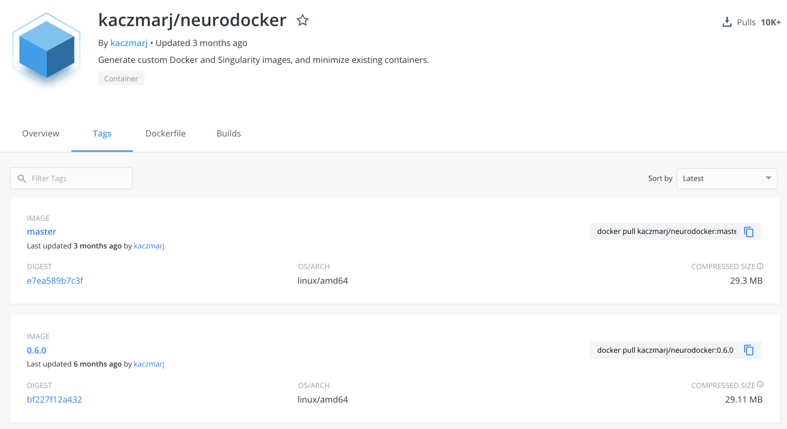

We will use the latest version with a specific tag, in this case: 0.6.0.
Our complete Docker pull command thus is:

.. code-block:: bash

    $ docker pull kaczmarj/neurodocker:0.6.0

After executing this command, you should see something like this:

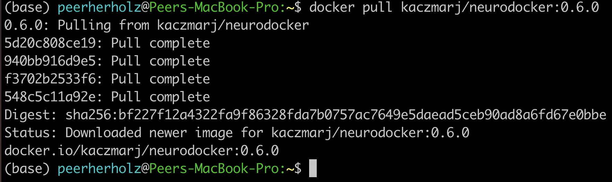

After stating the version of the container and where you are pulling it
from, you see four lines of cryptic number/letter combinations, followed
by “Pull complete”. These are the aforementioned layers that are
necessary to compose and create a given container. After that you get a
digest of the sha and the status message

.. code-block:: bash

    “Downloaded newer image for kaczmarj/neurodocker:0.6.0”

telling you, that you successfully pulled the container. In case you
don’t believe it (or me), you can run the docker images command to
verify that the image is there, additionally providing useful
information which includes the size of the image and when it was build:

.. code-block:: bash

    $ docker images

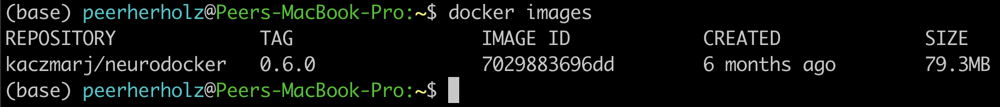

With that, we are ready to use Neurodocker to build not only the
container we need, but also the one we deserve! This is where the fun
really starts, as we now have the opportunity to recreate our computing
environment, isolate and share it. We can rebuild it, we have the
technology. From the Neurodocker page, we can grasp that it is used, as
most other Docker containers, through the command line and provides a
broad range of input arguments and settings. As it’s neither mine nor
your first day in the computer realm, we can anticipate some trial and
error along the process. Hence, let’s put our Neurodocker adventure in a
small script that will ease up the process big time and also, you
already guessed it, make it more reproducible. Long story short: we
create a bash file in our project directory and add some information:

.. code-block:: bash

    $ nano generate_enigma-sulci_images.sh

    #This is the neurodocker script to create the ENIGMA shape features pipeline container.

    ctrl + x

    y

Great! Off we go to the next step… HA, gotcha! You forgot to add this
new file to git, didn’t you? Please go to the corner of unreproducible
research and write “I need to add project files to git” one hundred
times. Go, I’ll wait...Done? Good. Let’s add our new file:

.. code-block:: bash

    $ git add generate_enigma-sulci_images.sh
    $
    $ git commit -m “Added generate_enigma-sulci_images.sh”

Better than standing in the corner, isn’t it?

From the examples included in the Neurodocker repo, we can see that we
can define a little bash function to help us. We will add that part
below our little explanation:

.. code-block:: bash

    $ nano generate_enigma-sulci_images.sh

    set -e
    generate_docker() {
        docker run --rm ${image} \
        generate docker \
    }

The first line “set -e” is a bash specific setting that will result in
an immediate exit of our little script or “program” in case an error
appears. The next part “generate docker() {}” defines a function called
“generate docker” with the function being whatever is inside “{}”. In
our case this is “docker run --rm ${image} generate docker” which is the
Docker command for running an image, here “${image}” and “generate
docker” is already part of the input arguments or settings of what this
“${image}” should do, in this case, generating a Dockerfile. You might
wonder: “What is ${image} actually?”. Good question! It’s a super
important variable we have yet to define. Remember the “tag” side quest
we had above? This of course also applies here, as we need to set the
specific version of Neurodocker we want to use. Reproducibility
transcends every level and aspect folks [6]_. Obviously, we are going to
use the version we pulled earlier:

.. code-block:: bash

    set -e

    image=kaczmarj/neurodocker:0.6.0

    generate_docker() {
        docker run --rm ${image} \
        generate docker \
    }

We now have the backbones of our script ready, as we defined a function
that runs a specific version of the Neurodocker container and indicates
that we would like to generate a Dockerfile. From the examples, we see
that we should define the input argument “--base” next. This is the
underlying operating system or “This is the operating system on which we
will build our computing environment!”. Container virtualization relies
on UNIX based system, in this case Linux distributions. While it’s
possible to build Windows containers (REFERENCE), macOS is not supported
(not to say that maybe somewhere in northern California (no, not Napa
Valley, a bit below) this exists). Instead of creating a shock for you,
it should create a feeling of relief as the majority of neuroimaging
analyses software runs natively on Linux but not Windows or macOS (here
macOS is actually doing ok because of its UNIX lineage). With regard to
our case, we are also lucky, because you used Ubuntu 12.04 to develop
and test the pipeline. Creating a container running Ubuntu 12.04 is
fairly easy based on our little function and Neurodocker, as we just
have to add the --base argument:

.. code-block:: bash

    set -e

    image=kaczmarj/neurodocker:0.6.0

    generate_docker() {
        docker run --rm ${image} \
        generate docker \
        --base ubuntu:12.04
   }

Furthermore, it is stated that we need to include the “--pkg-manager”
argument which will set the Linux package manager we want to install and
later utilize within our container. We will go with the classic ”apt”:

.. code-block:: bash

    set -e

    image=kaczmarj/neurodocker:0.6.0

    generate_docker() {
        docker run --rm ${image} \
        generate docker \
        --base ubuntu:12.04 \
        --pkg-manager apt
    }

As we can see from the documentation, the output of this function will
be text. Thus, we will direct or pass it into a text file (or better
yet, a text file named ‘Dockerfile’).

.. code-block:: bash

    set -e

    image=kaczmarj/neurodocker:0.6.0

    generate_docker() {
        docker run --rm ${image} \
        generate docker \
        --base ubuntu:12.04 \
        --pkg-manager apt
    }

    generate_docker > Dockerfile

Given that we use Ubuntu 12.04 as our base, we need to remove “locale
specific settings” as Neurodocker has some problems with such old Linux
distributions. As this is unfortunately really outside the scope of our
adventure (yes, there’s a thing as too many side quests), I would like
to point you to this thing called “the internet” if you want to follow
up on this. For now, we will remove the corresponding parts of our
Dockerfile which can be found in line 29-31:

.. code-block:: bash

    set -e

    image=kaczmarj/neurodocker:0.6.0

    generate_docker() {
        docker run --rm ${image} \
        generate docker \
        --base ubuntu:12.04 \
        --pkg-manager apt
    }

    generate_docker > Dockerfile

    sed -i '29d' Dockerfile
    sed -i '29d' Dockerfile
    sed -i '29d' Dockerfile

That’s it! That’s all we need. Before we conduct the first test run, we
need to commit the changes:

.. code-block:: bash

    $ git commit -m “update generate_docker function, base, pkg included”

You waited long enough, let’s run it:

.. code-block:: bash

    $ bash generate_enigma-sulci_images.sh

If everything went according to plan, you should see a new file called
Dockerfile. If you open it (e.g. using your favorite text editor), you
should see some cryptic things with some words that appear to be
familiar. Nope, these aren’t hieroglyphs, these are Docker specific
commands that are set within a Dockerfile and used within the build
process of Docker containers. By now, you are glad that Neurodocker did
write that for you, eh?

As usual, we will add our new file to version control and commit
changes:

.. code-block:: bash

    $ git add Dockerfile
    $ git commit -m “add first version of Dockerfile”

Everything is logged and we are good to go, our first custom made
container awaits. We will use the docker build command as follows:

.. code-block:: bash

    $ docker build -t enigma-sulci .

Where docker runs the Docker application, build specifies the Docker
command we want to run, -t provides our container with a and . indicates
that the information and settings found within the Dockerfile present in
the current directory should be used to build our container. Upon
running this command you should see something like the following (please
note that I won’t include the complete output as it’s very long, but
only the parts we focus on):

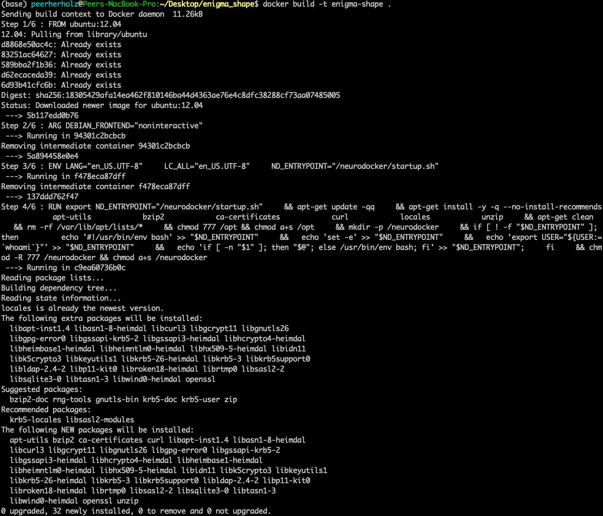

We can see our container being built with the specifics we set. At first
our base is pulled from Dockerhub. Yes, another dockerception moment! As
mentioned before, we will create our custom container based upon a
certain operating system. This is already in a Docker container and we
will use this instance as a starting point from which we will go
further. Next, the package manager is installed along with some basic
libraries. And with the line

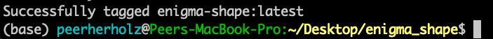

our container is done-zel washington. Not kidding, it was as easy as
that! Don’t believe it? Use docker images to verify that our container
is in fact there.

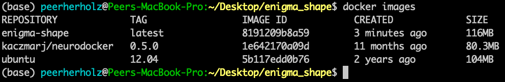

Now, you are feeling it right? This immense power? The incredible,
endless possibilities? Please, as always: don’t get corrupted by it.
That’s the path to the dark side. But wait...here, the dark side is
actually good, as it’s fully reproducible! Phew, existential crisis
averted. Let’s use the momentum and keep going. Our next building block
are libraries and binaries we are going to need for our pipeline to work
properly. This part heavily depends on your workflow and pipeline,
except some very common libraries and binaries. To be honest, this part
is quite often trial and error as you are most likely not aware of all
the things running in the background that are essential for your
operating system and thus specific application. Lessons learned, eh? If
something is missing, you will receive an error message stating
something like:

.. code-block:: bash

    “error while loading shared libraries: *library_name*: cannot open shared object file: No such file or directory”

In this case, use your favorite search engine to search for this
particular problem and with a fair chance you are not the first one to
run into this and someone has posted the solution which, in the majority
of cases, is to install whatever is missing. As we’re going to use
neurodocker’s “--install” argument to provide a space separated list of
libraries that should be installed, you can just add “missing parts” and
rebuild your container. For our current example, we are once again lucky
and know what needs to be installed for our pipeline to work. Thus we
can indicate this in our function accordingly:

.. code-block:: bash

    set -e

    image=kaczmarj/neurodocker:0.6.0

    generate_docker() {
        docker run --rm ${image} \
        generate docker \
        --base ubuntu:12.04 \
        --pkg-manager apt \
        --install curl git gcc g++ imagemagick \
        xvfb r-base libgl1-mesa-dev \
        num-utils libqt4-dev \
        libqt4-opengl-dev libqt4-sql \
        libqt4-sql-mysql
    }

    generate_docker > Dockerfile

    sed -i '29d' Dockerfile
    sed -i '29d' Dockerfile
    sed -i '29d' Dockerfile

*Please note that depending on your pipeline, this list can be very
short or very long, easy or hard to assemble. Don’t give up, searching
the world wide web and asking questions in suited forums
like Neurostars (www.neurostars.org) will lead to
the answer! Don’t worry, these things need time, practice and
experience, especially if you are new to all of this!*

Ok, motivational section over, let’s continue. For the price of fully
reproducible research: we now continue with: a) binge watching GoT, b)
git commit our changes or c) question our career choice. It’s obviously
answer b) (even though a) would also be acceptable):

.. code-block:: bash

    $ git commit -m “add library install to generate_enigma-sulci.sh”

Now, we can recreate our Dockerfile and rebuild our container. Based on
our function all we need to do is:

.. code-block:: bash

    $ bash generate_enigma-sulci.sh
    $ git commit -m “include library install in Dockerfile”
    $ docker build -t enigma-sulci .

You should see that instead of recreating everything from scratch our
previous container version is reused as those underlying components did
not change, only the new parts are added and a new container with the
same is created.

*Please note that a given version of a container can never be changed,
but only a new version with respective changes be created.*

If you check your newly created container, you will notice a larger file
size as we added additional libraries:

.. code-block:: bash

    $ docker images

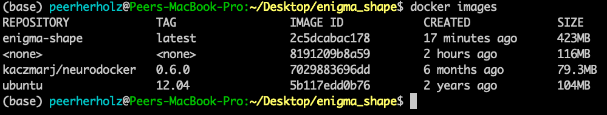

Oh, what’s that? A wild Docker image with no name and tag appeared! Let
me rephrase that: “Hello Docker container my old friend…” . It is in
fact the previous version of our container that was “untagged” .

Please note that rebuilding a container won’t automatically remove the
current/previous version. We have do this manually using the “rmi”
(remove image) command within which we provide the arbitrary IMAGE ID of
the container we won’t to remove as input:

.. code-block:: bash

    $ docker rmi 8191209b8a59

If we now check again, we can verify, that the old version was removed:

.. code-block:: bash

    $ docker images

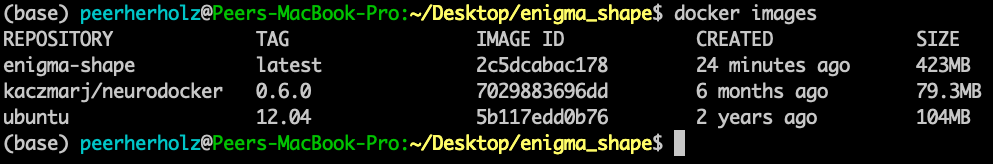

We are really making some progress here, awesome! Off we go to the next
thing or should I say layer (muhaha → sinister laugh). While checking
your code again, you remember that you installed FreeSurfer some time
ago to utilize some of its functions within your pipeline. Thus, we need
to include it in our container as well. To do so, we will basically
conduct the steps one would normally go through, but in a Neurodocker
way. More precisely, we need to run some bash commands in order to
first, download the FreeSurfer software, second, unzip the downloaded
file and third, set the “FREESURFER_HOME” environment variable. I
assume, by now you started to worry less about these things as you
already experienced Neurodocker in all its beauty. And you’re completely
right to do so! Setting or running bash commands is a no-brainer with
Neurodocker: the “--run-bash” argument!

The first two points are set via:

.. code-block:: bash

    “--run-bash "curl -sSL https://surfer.nmr.mgh.harvard.edu/pub/dist/freesurfer/6.0.1/freesurfer-Linux-centos6_x86_64-stable-pub-v6.0.1.tar.gz \| tar zxv --no-same-owner -C /opt”

which runs the curl command to download the FreeSurfer software and then
uses tar to unzip the downloaded file into the directory /opt. As you
can see, all you have to do is pass the bash command as you would use on
your local machine to the --run-bash argument. Given that we run this
command during the build process of our container, the respective steps
are conducted *within* the container, thus the directory */opt* is a
path in the to be created container! While typing you remember that you
deleted a bunch of FreeSurfer files as they were very big and you didn’t
need them for your pipeline. So, instead of packing those things in your
container, thus unnecessarily increasing its size, we will just exclude
them. No biggie!

.. code-block:: bash

    “--run-bash "curl -sSL https://surfer.nmr.mgh.harvard.edu/pub/dist/freesurfer/6.0.1/freesurfer-Linux-centos6_x86_64-stable-pub-v6.0.1.tar.gz \| tar zxv --no-same-owner -C /opt \
        --exclude='freesurfer/diffusion' \
        --exclude='freesurfer/docs' \
        --exclude='freesurfer/fsfast' \
        --exclude='freesurfer/lib/cuda' \
        --exclude='freesurfer/matlab' \
        --exclude='freesurfer/mni/share/man' \
        --exclude='freesurfer/subjects/fsaverage_sym' \
        --exclude='freesurfer/subjects/fsaverage' \
        --exclude='freesurfer/subjects/fsaverage3' \
        --exclude='freesurfer/subjects/fsaverage4' \
        --exclude='freesurfer/subjects/fsaverage5' \
        --exclude='freesurfer/subjects/fsaverage6' \
        --exclude='freesurfer/subjects/cvs_avg35' \
        --exclude='freesurfer/subjects/cvs_avg35_inMNI152'\
        --exclude='freesurfer/subjects/bert' \
        --exclude='freesurfer/subjects/lh.EC_average'\
        --exclude='freesurfer/subjects/rh.EC_average'\
        --exclude='freesurfer/subjects/sample-*.mgz' \
        --exclude='freesurfer/subjects/V1_average' \
        --exclude='freesurfer/trctrain'" \\”

Good catch, that will save us, that is the Docker container, some space.

Now to the second point. In order to set environment variables, we can
use the --env argument followed by the variable definition as you would
do it in bash:

.. code-block:: bash

    “--env FREESURFER_HOME="/opt/freesurfer" “

Damn, Neurodocker has it all! All we have to do now is including these
things in our function:

.. code-block:: bash

    set -e

    image=kaczmarj/neurodocker:0.6.0

    generate_docker() {
        docker run --rm ${image} \
        generate docker \
        --base ubuntu:12.04 \
        --pkg-manager apt \
        --install curl git gcc g++ imagemagick \
        xvfb r-base libgl1-mesa-dev \
        num-utils libqt4-dev \
        libqt4-opengl-dev libqt4-sql \
        Libqt4-sql-mysql \
        --run-bash "curl -sSL https://surfer.nmr.mgh.harvard.edu/pub/dist/freesurfer/6.0.1/freesurfer-Linux-centos6_x86_64-stable-pub-v6.0.1.tar.gz \| tar zxv --no-same-owner -C /opt \
        --exclude='freesurfer/diffusion' \
        --exclude='freesurfer/docs' \
        --exclude='freesurfer/fsfast' \
        --exclude='freesurfer/lib/cuda' \
        --exclude='freesurfer/matlab' \
        --exclude='freesurfer/mni/share/man' \
        --exclude='freesurfer/subjects/fsaverage_sym' \
        --exclude='freesurfer/subjects/fsaverage' \
        --exclude='freesurfer/subjects/fsaverage3' \
        --exclude='freesurfer/subjects/fsaverage4' \
        --exclude='freesurfer/subjects/fsaverage5' \
        --exclude='freesurfer/subjects/fsaverage6' \
        --exclude='freesurfer/subjects/cvs_avg35' \
        --exclude='freesurfer/subjects/cvs_avg35_inMNI152'\
        --exclude='freesurfer/subjects/bert' \
        --exclude='freesurfer/subjects/lh.EC_average'\
        --exclude='freesurfer/subjects/rh.EC_average'\
        --exclude='freesurfer/subjects/sample-*.mgz' \
        --exclude='freesurfer/subjects/V1_average' \
        --exclude='freesurfer/trctrain'" \
        “--env FREESURFER_HOME="/opt/freesurfer" “ }

    generate_docker > Dockerfile

    sed -i '29d' Dockerfile
    sed -i '29d' Dockerfile
    sed -i '29d' Dockerfile

We are good ReproNimers and commit the changes:

.. code-block:: bash

    $ git commit -m “include FreeSurfer in generate_enigma-sulci.sh”

Tale as old as time: recreate the Dockerfile, commit the changes and
rebuild the container!

.. code-block:: bash

    $ bash generate_enigma-sulci.sh
    $ git commit “include FreeSurfer in Dockerfile”
    $ docker build -t enigma-sulci .

After you pressed “enter”, go get a coffee (or rather 10 coffees), as
the FreeSurfer file is quite large and the download will take a while.
And as the years have passed by, the download will eventually finish and
our container will be built, this time with FreeSurfer included. As
usual, we can confirm that it’s there and notice the, this time quite
impressive, increase in size (wholly guacamole!). Also, we remove the
old version:

.. code-block:: bash

    $ docker images

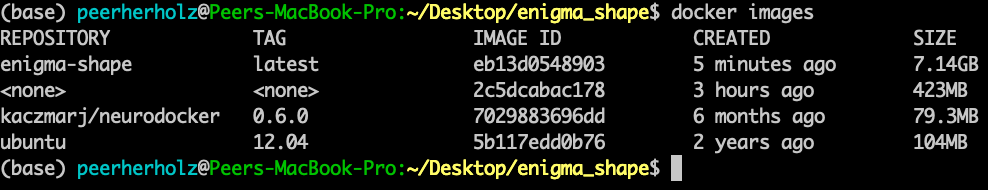

.. code-block:: bash

    $ docker rmi 2c5dcabac178

Ok, we’re getting somewhere. Slow but steady. Next in line is
BrainVISA [7]_, another software package your pipeline depends on. It
feels like the ReproNim version of Groundhog Day doesn’t it? Wait,
what’s that? You are tired of downloads and asking if we can’t just copy
the software from your machine into the container somehow? Well, what do
you think this is? Amateur hour? Of course we and you can bet all your
other so-far unreproducible pipelines that neurodocker has you covered!
However, first things first: we copy the directory that contains the
software into our project directory and add it to git, committing the
changes:

.. code-block:: bash

    $ mv /home/frodo/work/brainvisa /home/frodo/enigma_shape
    $ git add brainvisa
    $ git commit -m “added brainvisa to the project directory”

To now copy this directory into our container during the build process,
we can use the --copy argument with the directory we want to copy and
where within the container as input arguments:

.. code-block:: bash

    --copy brainvisa_4.5.0 /opt/brainvisa_4.5.0

We add it to our function (I will stop to include every instance of the
function as it’s getting longer and longer. The complete, final version
will be displayed at the end of this section) and conduct the well-known
steps: commit and rebuild.

.. code-block:: bash

    $ git commit -m “added brainvisa to generate_enigma-sulci.sh ”
    $ bash generate_enigma-sulci.sh
    $ git commit -m “added brainvisa to Dockerfile”
    $ docker build -t enigma-sulci .
    $ docker images
    $ docker rmi

You see that thingy over there? That’s the finish line and you are
almost there! The next part is your pipeline and we can use the same
commands as above to include in the container building script:

.. code-block:: bash

    --copy shape_features_pipeline /opt/shape_features_pipeline

.. code-block:: bash

    $ git commit -m “added enigma-sulci pipeline to generate_enigma-sulci.sh ”
    $ bash generate_enigma-sulci.sh
    $ git commit -m “added enigma-sulci pipeline to Dockerfile”
    $ docker build -t enigma-sulci .
    $ docker images
    $ docker rmi XXX

Wanna know what? That’s it: you isolated a computing environment and are
able to share it for example using cloud storage, USB or repositories.
The finish line my friend is blowing in the reprowind. You can now start
work with your container via:

.. code-block:: bash

    $ docker run enigma-sulci

Where the run command will start your container and, in this case, bring
you to the shell within your container. While you could already start
running (noticed the pun?) and testing your pipeline within the
container, we will go one step further. This is the Reprolympics!
Instead of always starting your container, cd’ing to and sourcing your
pipeline, adding local data within mapped paths, you can actually save
this precious time for more fun things (talking analyses of course) via
automating the behavior of your container. This refers to functions or
tasks that are defined to be executed during the start of your
container. The other benefit besides saving time? Reproducibility!

**Step 3:** Automating your container
^^^^^^^^^^^^^^^^^^^^^^^^^^^^^^^^^^^^^

A common example of containers with such behavior are BIDS-Apps
(http://bids-apps.neuroimaging.io/), containerized pipelines or
applications that understand BIDS. While you could adapt your pipeline
to also work very well with BIDS datasets, we won’t go down that rabbit
hole for now and leave the pipeline dataset agnostic. Speaking of which,
how does your pipeline work again? Oh, that’s right the main function is
run_pipeline.sh and it assumes that the data you want to process are in
a directory called \`/freesurfer_data\` and based on that wants the
identifier of the participant you want to analyse within that directory
as input. Furthermore, it needs a FreeSurfer license. Finally, it will
save the results to a directory called /output. We can make a respective
automatization happen through two steps. First, we need to tell the
container that your pipeline should be executed upon starting. This
behavior can be achieved through modifying the entrypoint of your
container. Neurodocker’s way of doing this is the --entrypoint argument
and we can use add to add the main function of your pipeline which is
located in /opt/shape-features-pipeline to the entrypoint or startup of
the container:

.. code-block:: bash

    --entrypoint "/neurodocker/startup.sh /opt/ENIGMA_BV45/run_brainvisa45.sh"

With that, your main function is automatically executed every time you
run your container. And now, for the last time: commit and rebuild:

.. code-block:: bash

    $ git commit -m “added main function to entrypoint in generate_enigma-sulci.sh”
    $ bash generate_enigma-sulci.sh
    $ git commit -m “added main function to entrypoint in Dockerfile”
    $ docker build -t enigma-sulci .
    $ docker images
    $ docker rmi

The next step entails an adaption of the docker run command. We need to
make the data directory, the output directory and a FreeSurfer license
available within our container. Quick reminder: our computing
environment is isolated, the doors of the container are close, nothing
in, nothing out. Except, we create the possibility for the container to
interact with files and paths on your local machine or in container
terms host machine. This process is called mapping and implemented
through the -v flag which expects two arguments: a path or file on your
host machine and a path where it should be mapped to inside the
container. Adjusted to our needs, this would look as follows:

.. code-block:: bash

    -v /home/frodo/freesurfer_outputs:/fs_data
    -v /home/frodo/shape_analyses:/output
    -v /home/frodo/freesurfer/license:/opt/freesurfer/license

The first two map the input data and output directory respectively,
while the third maps the FreeSurfer license file. We can now bring it
all together and also add the ID of the participant that should
analyzed, let’s call him Spock:

.. code-block:: bash

    docker run -v /home/frodo/freesurfer_outputs:/fs_data \
        -v /home/frodo/shape_analyses:/output \
        -v /home/frodo/freesurfer/license:/opt/freesurfer/license \
        enigma-sulci \
        Spock

This, this is the moment. Experience it in all its glory. You have come
a long way. From a complex pipeline that only worked on your machine and
was shared by email to an application that works for everyone that has
Docker installed and can be shared via version controlled repositories
that are accessible for everyone. What a ride! Let’s bring it home and
actually push your container to DockerHub:

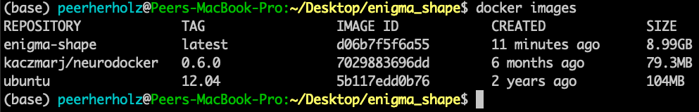

.. code-block:: bash

    $ docker tag d06b7f5f6a55 frodo/enigma-sulci
    $ docker push frodo/enigma-sulci

Your container can now be ‘pulled’ by others! However, there’s always
room for more reproducibility...

**Step 4:** It’s getting meta
^^^^^^^^^^^^^^^^^^^^^^^^^^^^^

During the beginning of our ancient history, something about version
controlled data was mentioned. And while this is strictly speaking not
part of bringing your pipeline into a container, it should be! Because
these days, we have the possibility to connect your containerized
pipeline to a dataset you want to process it with. Furthermore, we
version control the application of our container. The future is now! A
future called DataLad [8]_. Learn all about it
`here <http://handbook.datalad.org/en/latest/>`__. We will discuss this
further in future chapters of this story.

**Step 5:** Going the extra mile - automated builds, perturbation analyses and more
^^^^^^^^^^^^^^^^^^^^^^^^^^^^^^^^^^^^^^^^^^^^^^^^^^^^^^^^^^^^^^^^^^^^^^^^^^^^^^^^^^^

There are many more chapters to this never-ending story. Stay tuned for
more ways to enhance your reproducibility and efficiency. Chapters will
include: automated builds from github; testing different base systems to
see if updates to newer base is possible; and many more.

.. _vol9_costs:

What did this cost me?
^^^^^^^^^^^^^^^^^^^^^^

In the long term, this did not cost you much, all the steps covered here
are things you already had to do anyway. You procured a computer, you
installed a base operating system, you installed a bunch of software
tools you needed and solved their dependencies, you developed a
processing script, and you used that script. The cost, in this example,
of a retrospective application of these procedures is in remembering
what you had to do in order to make this work, which could have been a
development timeline that spanned multiple years. And you had to learn
about containerization, Docker specifically in this case, and a new tool
to help you perform containerization (NeuroDocker, in this case).

.. _vol9_gains:

What have I gained?
^^^^^^^^^^^^^^^^^^^

Going forward, building each of your specific processing workflows using
the complete enumeration of all the details necessary to the
implementation of that process greatly facilitates your own reuse of the
workflow going forward. You have gained clarity and reproducibility and
complete ‘describability’ for your ‘future self’, the readers of
wonderful manuscripts, and provide a foundation upon which your results
and conclusions can more seamlessly fit into the fabric of the emerging
scientific knowledge. Also, your shared container is a scientific
product of your research efforts, and itself is reusable, citable, and
can be a source of scientific productivity to advance your research
career. You can’t get any of that from a script sitting on your lab
computer...

.. _vol9_conclusion:

Conclusion
^^^^^^^^^^

Appendix 1: The final generate_enigma-sulci_images.sh script
^^^^^^^^^^^^^^^^^^^^^^^^^^^^^^^^^^^^^^^^^^^^^^^^^^^^^^^^^^^^

.. [1]
   https://repronim.org/aboutus.html

.. [2]
   https://surfer.nmr.mgh.harvard.edu/

.. [3]
   http://enigma.ini.usc.edu/

.. [4]
   https://www.datalad.org/

.. [5]
   https://git-scm.com/

.. [6]
   https://github.com/myyoda/poster/blob/master/ohbm2018.pdf

.. [7]
   http://brainvisa.info/web/index.html

.. [8]
   https://www.datalad.org/
